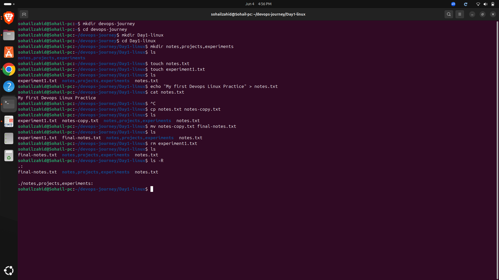
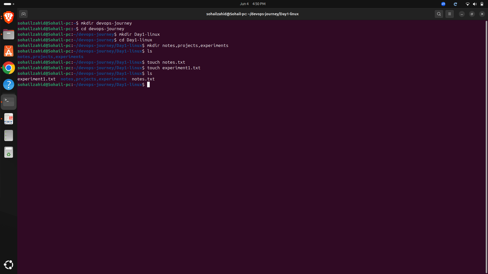
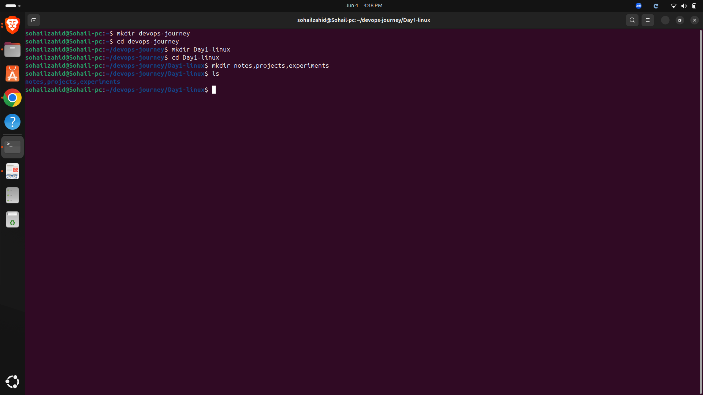

# Day 01 - Linux Fundamentals

## Objective

Learn the basics of Linux, understand the Linux directory structure, and practice essential navigation commands.

---

## Topics Covered

- Introduction to Linux
- Linux File System Hierarchy
- Basic Linux Commands
- Directory Navigation

---

## Commands Practiced

```bash
pwd
ls
ls -l
cd
mkdir
rmdir
```

---

## Key Learnings

- Understanding the Linux file system
- Navigating between directories
- Creating and removing directories
- Viewing files and folders

---

## Screenshots

### Linux Directory Structure



### ls Command Output



### mkdir Command



---

## Outcome

Successfully understood Linux fundamentals, directory navigation, and basic file system operations.
