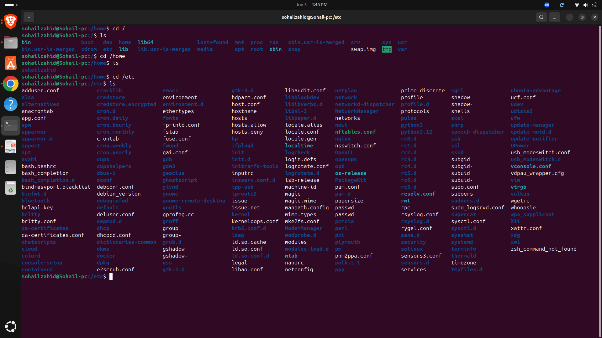
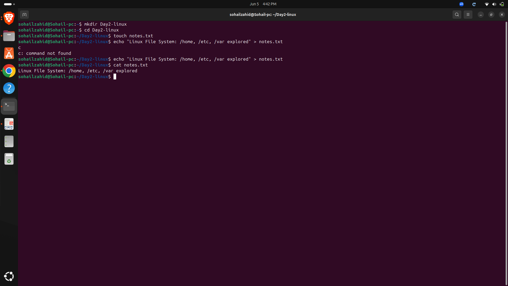

# Day 02 - Linux File System

## Objective

Understand the Linux file system hierarchy and learn the purpose of important system directories.

---

## Topics Covered

- Linux File System Hierarchy
- Root Directory (/)
- Home Directory
- System Directories
- Variable Data Storage

---

## Commands Practiced

```bash
pwd
ls
ls -l
cd
tree
```

---

## Key Directories Explored

| Directory | Purpose |
|------------|----------|
| / | Root directory of the Linux file system |
| /home | User home directories |
| /etc | System configuration files |
| /var | Variable data such as logs and cache |
| /bin | Essential user commands |
| /usr | User applications and utilities |
| /tmp | Temporary files |
| /dev | Device files |

---

## Key Learnings

- Linux follows a hierarchical directory structure.
- Every file and directory starts from the root directory (/).
- Configuration files are generally stored in /etc.
- User data is stored inside /home.
- System logs are commonly stored in /var/log.

---

## Screenshots

### Linux File System Structure



### Notes and Directory Exploration



---

## Outcome

Successfully explored the Linux file system hierarchy and understood the purpose of major system directories.
