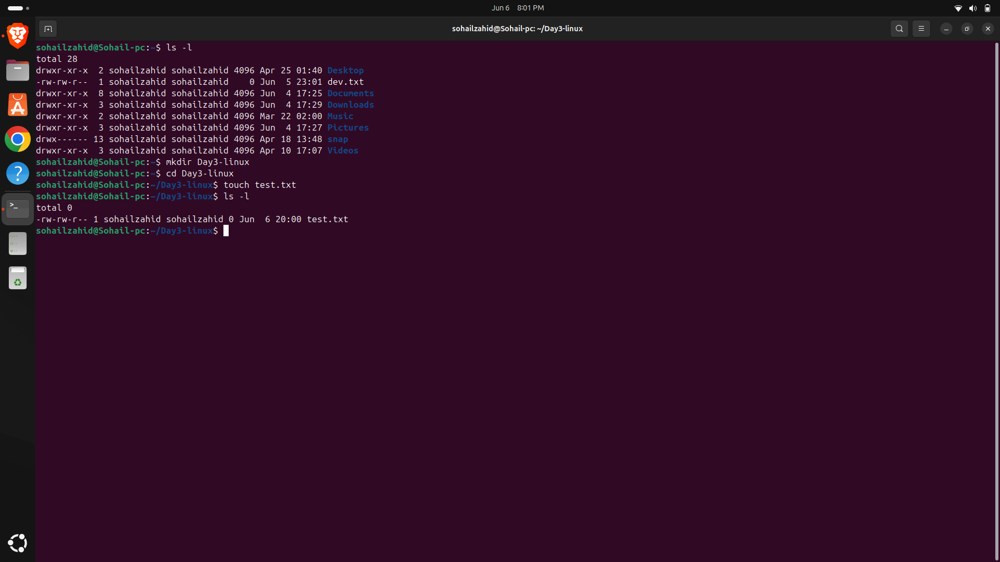
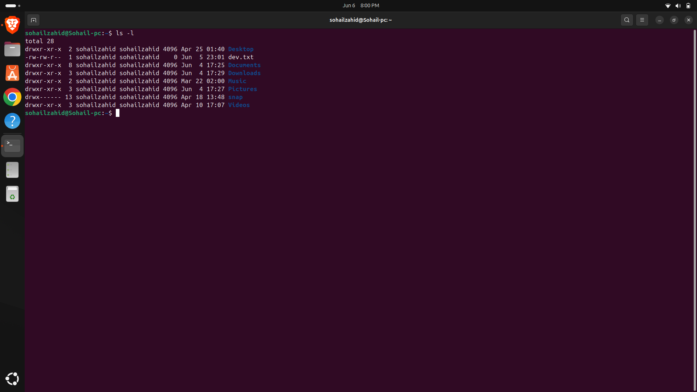
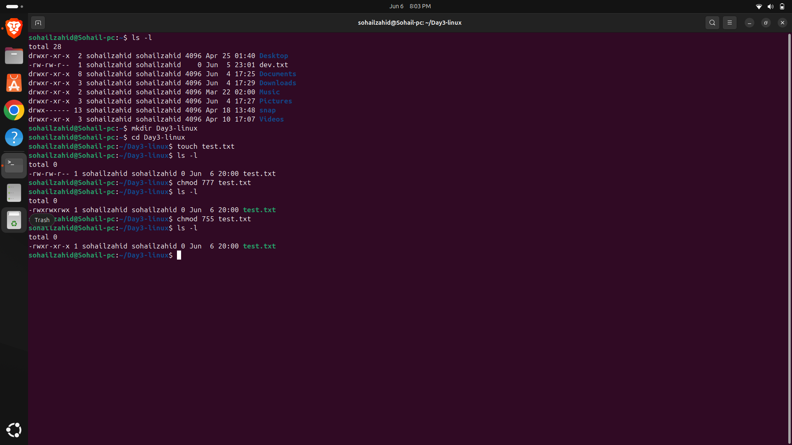
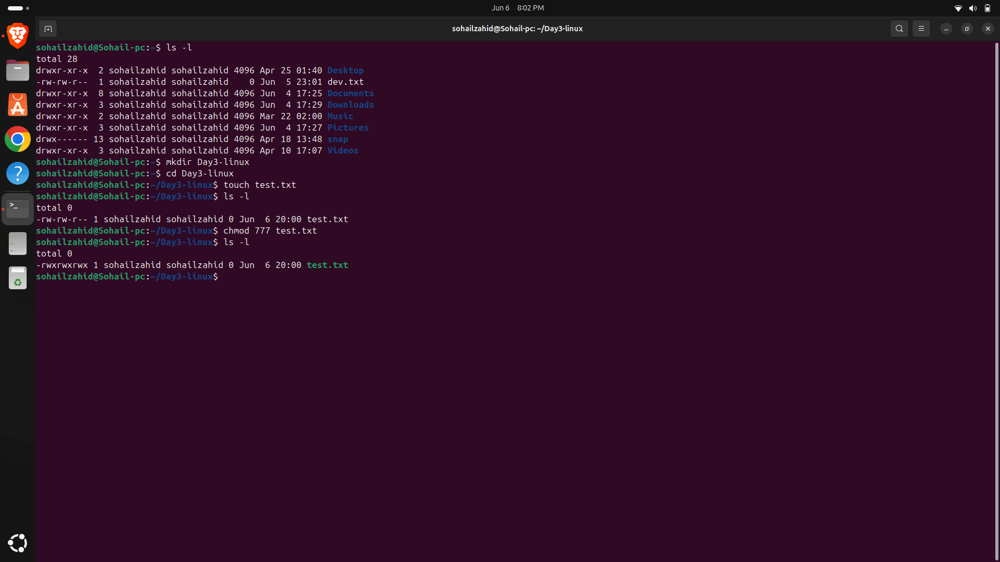

# Day 03 - Linux File Permissions

## Objective

Learn how Linux file permissions work and how to control access using permission settings.

---

## Topics Covered

- File Permissions
- Ownership
- Read, Write and Execute Permissions
- Numeric Permission System
- chmod Command

---

## Commands Practiced

```bash
ls -l
chmod 755 filename
chmod 777 filename
chmod +x filename
```

---

## Understanding Permissions

| Permission | Value |
|------------|--------|
| Read (r) | 4 |
| Write (w) | 2 |
| Execute (x) | 1 |

### Common Permission Sets

| Permission | Meaning |
|------------|----------|
| 755 | Owner has full access, others can read and execute |
| 777 | Everyone has full access |
| 644 | Owner can read/write, others can only read |

---

## Key Learnings

- Linux controls access through permissions.
- Permissions are assigned to:
  - User (Owner)
  - Group
  - Others
- chmod is used to modify file permissions.
- Excessive permissions such as 777 should be avoided in production environments.

---

## Screenshots

### File Creation



### Permissions Before Modification



### Permission Change - 755



### Permission Change - 777



---

## Outcome

Successfully configured and verified Linux file permissions using the chmod command while understanding permission management best practices.
