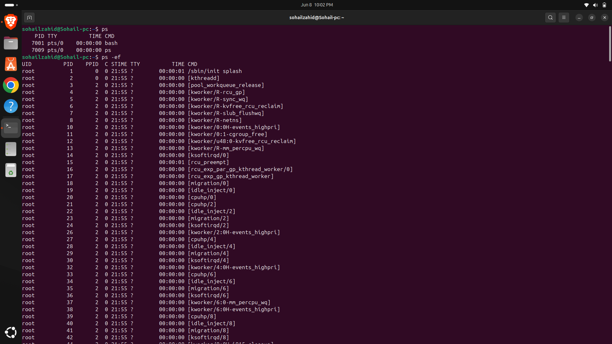
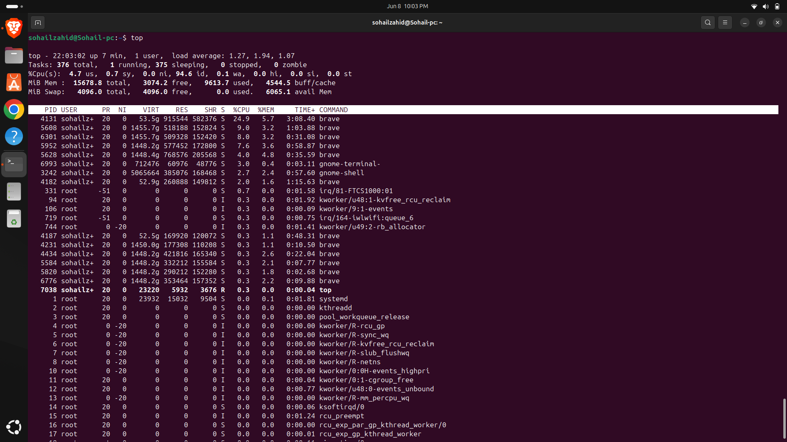
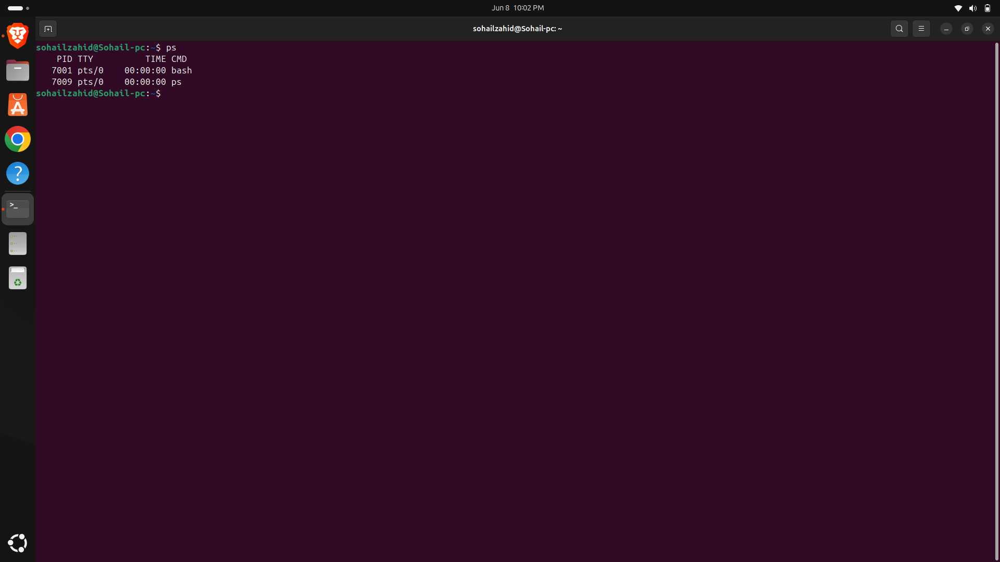
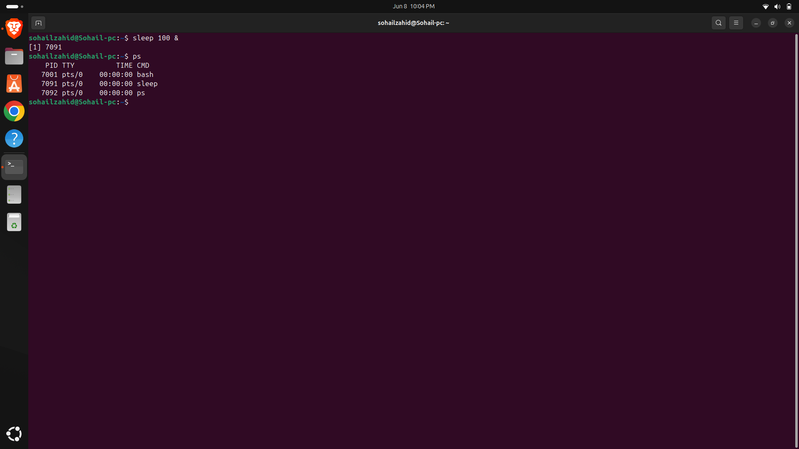
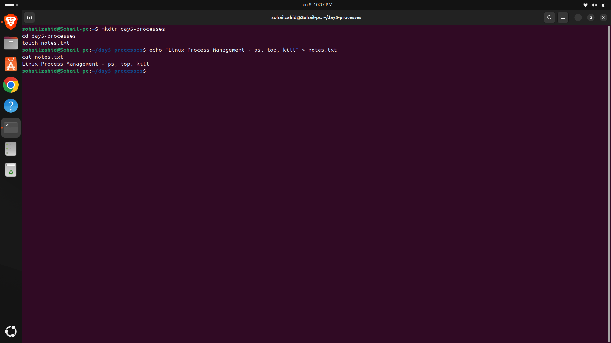

# Day 05 - Process Management

## Objective

Learn how Linux handles running processes and how to monitor and manage them.

---

## Topics Covered

- Process Lifecycle
- Background and Foreground Processes
- Process Monitoring
- Process Termination

---

## Commands Practiced

```bash
ps
top
htop
kill
killall
jobs
bg
fg
```

---

## Key Learnings

- Viewing active processes
- Monitoring system resource utilization
- Managing foreground and background tasks
- Terminating unwanted processes

---

## Screenshots

### Process Listing using ps



### Process Monitoring using top



### Running Processes



### Sleep Command Demonstration



### Process Practice File



---

---

## Outcome

Successfully monitored and controlled processes in a Linux environment.
