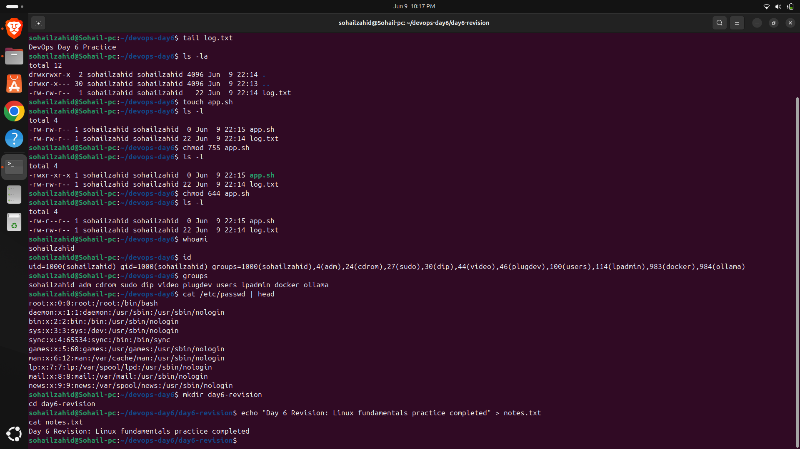
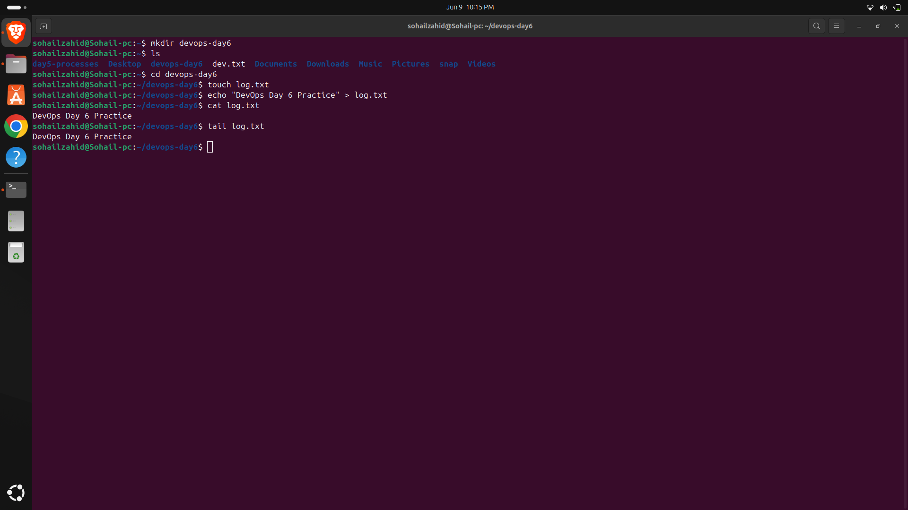
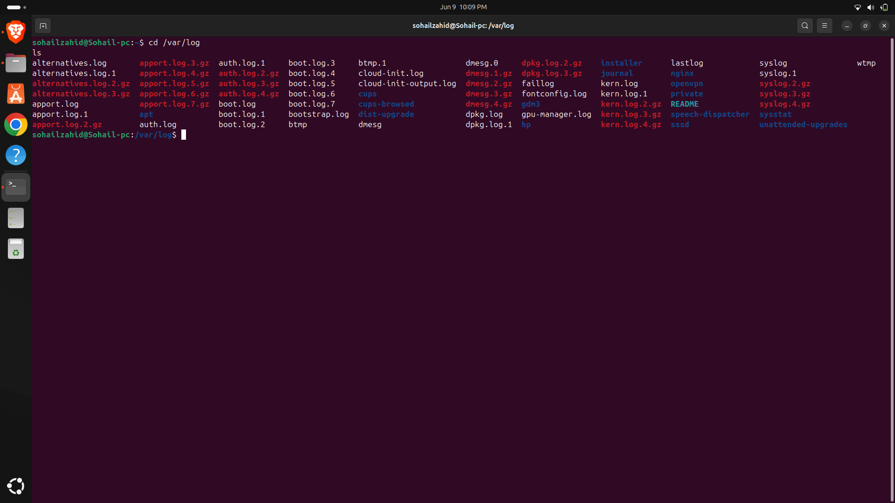

# Day 06 - Linux Fundamentals Revision

## Objective

Review and reinforce Linux concepts learned during Week 1.

---

## Topics Revised

- Linux Basics
- File System Structure
- File Permissions
- Users and Groups
- Process Management

---

## Practice Activities

- Navigation Commands
- File Creation and Deletion
- Permission Changes
- User Management
- Process Monitoring

---

## Outcome

Consolidated foundational Linux concepts through revision and hands-on practice.

---

---

## Screenshots

### day6revision.png

### process

### list

### (ps).png

.png)

### fileCat.png

### varlog.png

### chmod

### changes.png

