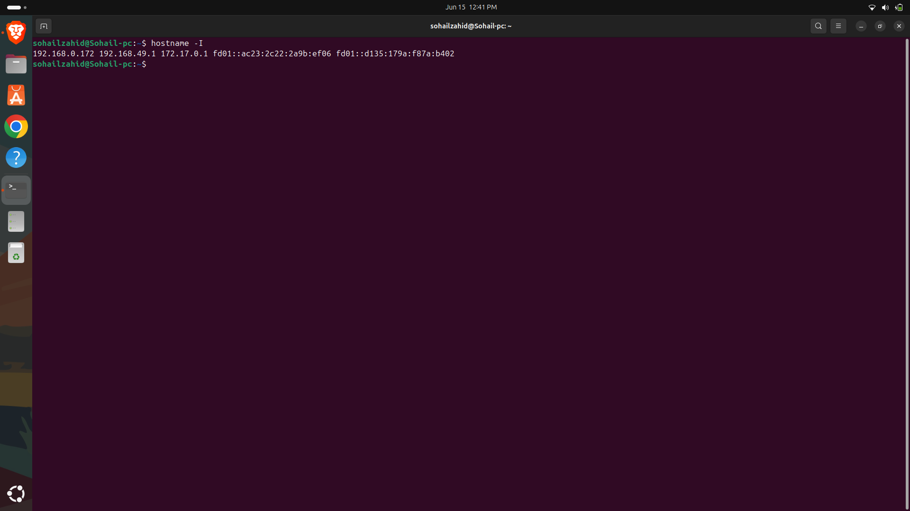
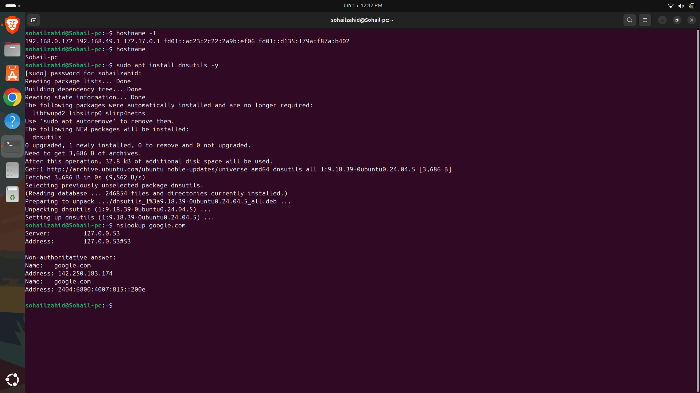
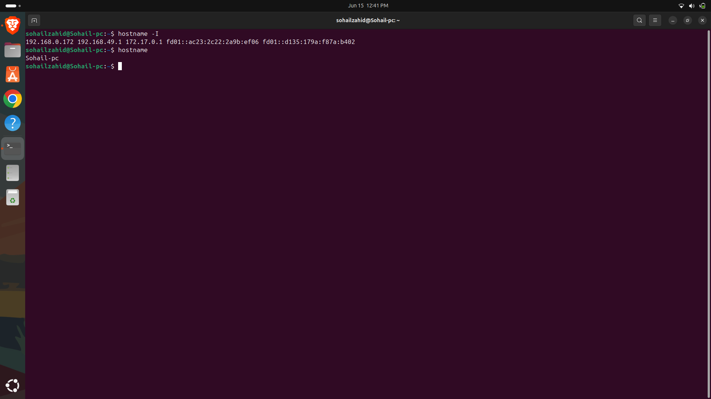
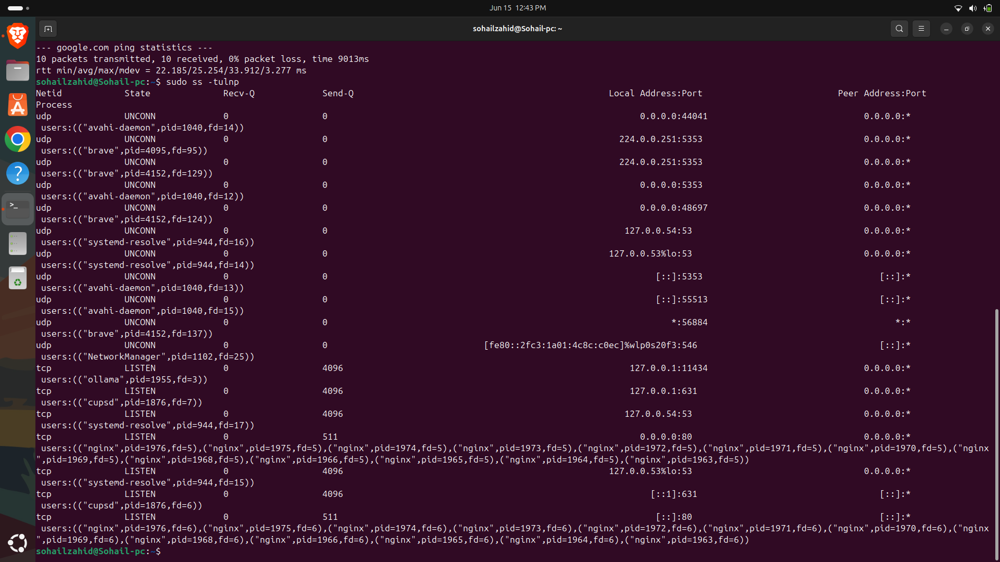
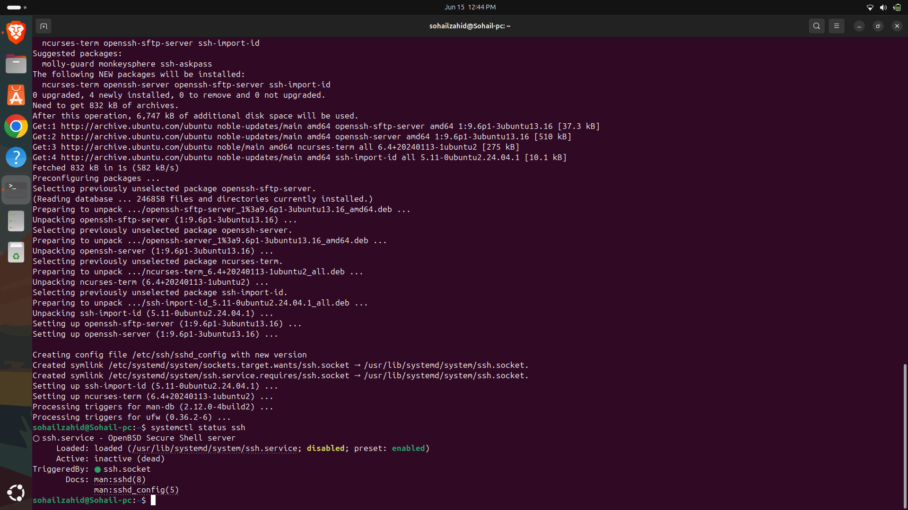
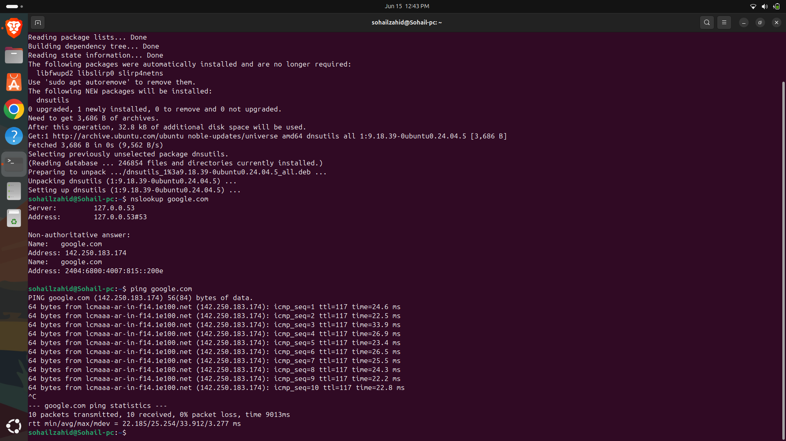

# Day 10 - Linux Networking Basics

## Objective

Understand Linux networking fundamentals and troubleshoot connectivity issues.

---

## Topics Covered

- IP Addressing
- Network Interfaces
- Connectivity Testing
- DNS Resolution

---

## Commands Practiced

```bash
ip a
ip route
ping
hostname
nslookup
netstat
```

---

## Key Learnings

- Viewing network configurations
- Testing connectivity
- Understanding routing concepts
- Troubleshooting basic network issues

---

## Outcome

Successfully explored Linux networking and connectivity troubleshooting.


---


---

## Screenshots

### hostid.png



### dnslookup.png



### ownerhost.png



### openPorts.png



### SSHstatus.png



### pingResult.png



