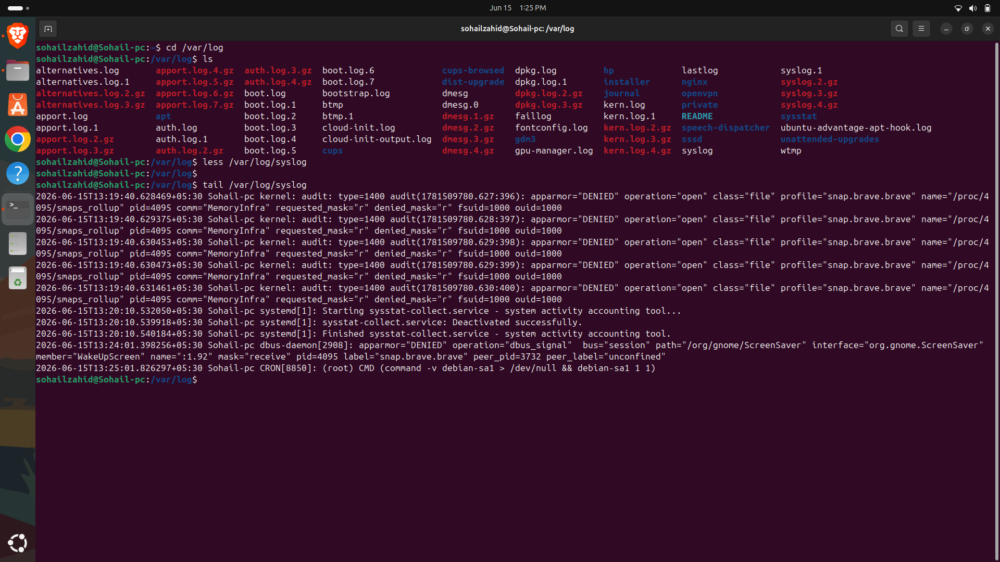
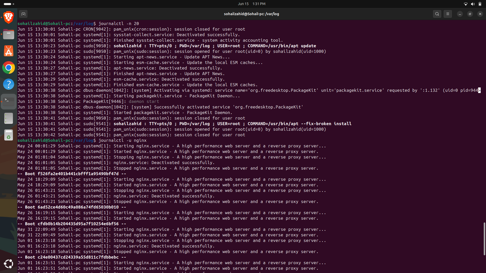
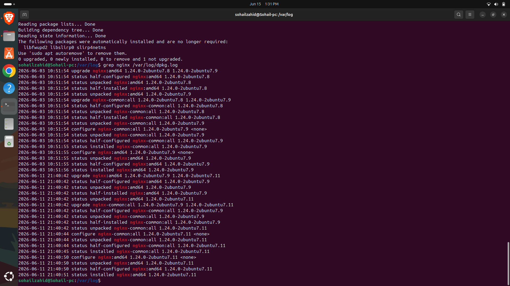
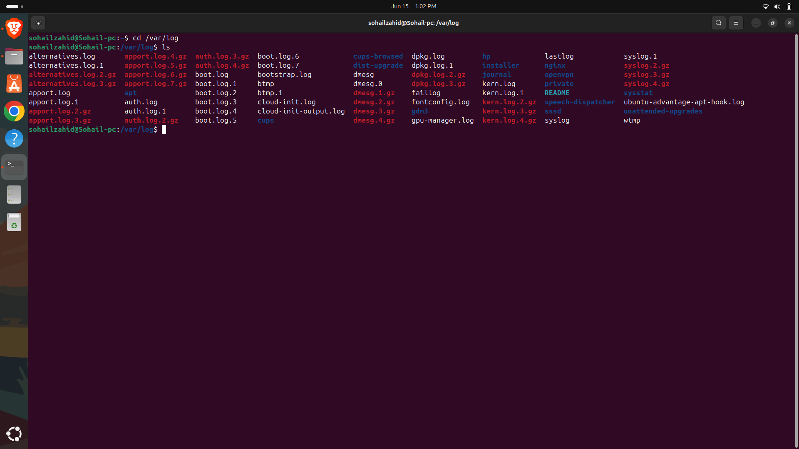
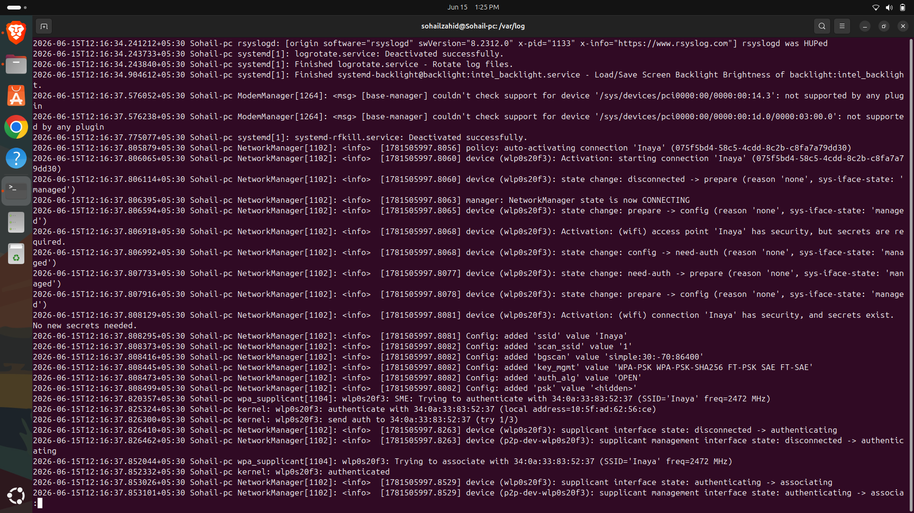

# Day 11 - Log Analysis

## Objective

Learn how to analyze system logs for troubleshooting and monitoring.

---

## Topics Covered

- Log Files
- Log Monitoring
- System Events
- Troubleshooting

---

## Commands Practiced

```bash
cat
less
tail
tail -f
grep
journalctl
```

---

## Key Learnings

- Reading Linux log files
- Monitoring system activity
- Identifying errors and warnings
- Using logs for troubleshooting

---

## Outcome

Successfully analyzed system logs and investigated system events.


---


---

## Screenshots

### tailLogs.png



### journalCtl.png



### grepNginx.png



### varLog.png



### SysLogs.png



