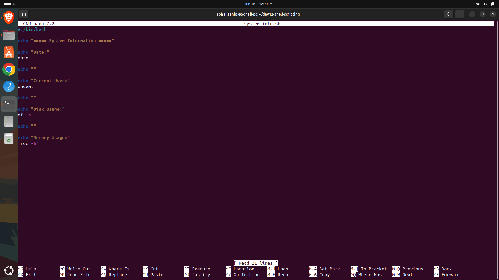
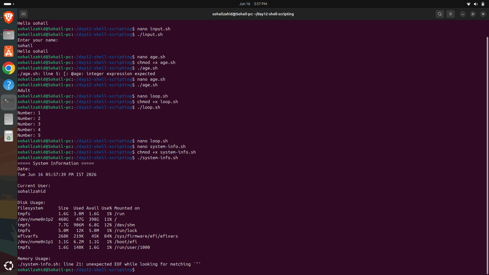
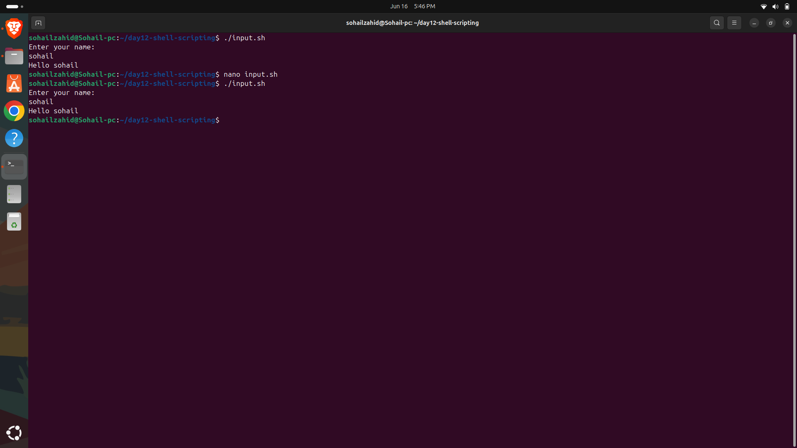
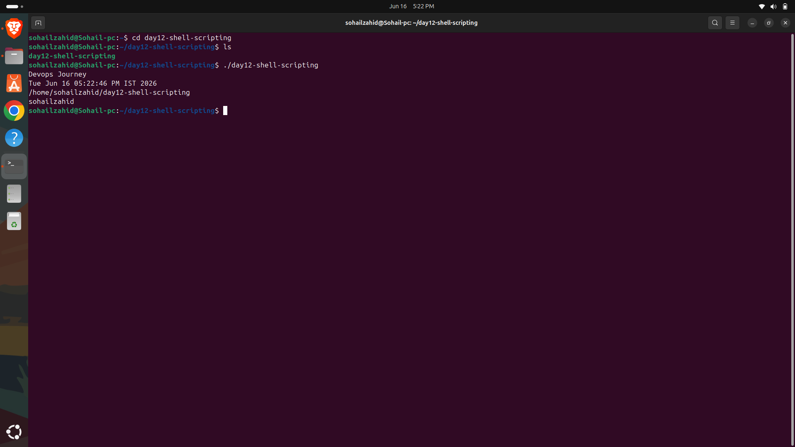
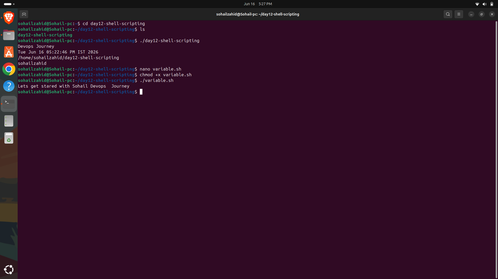
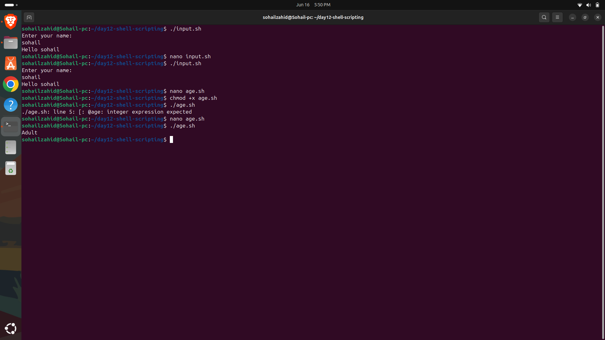
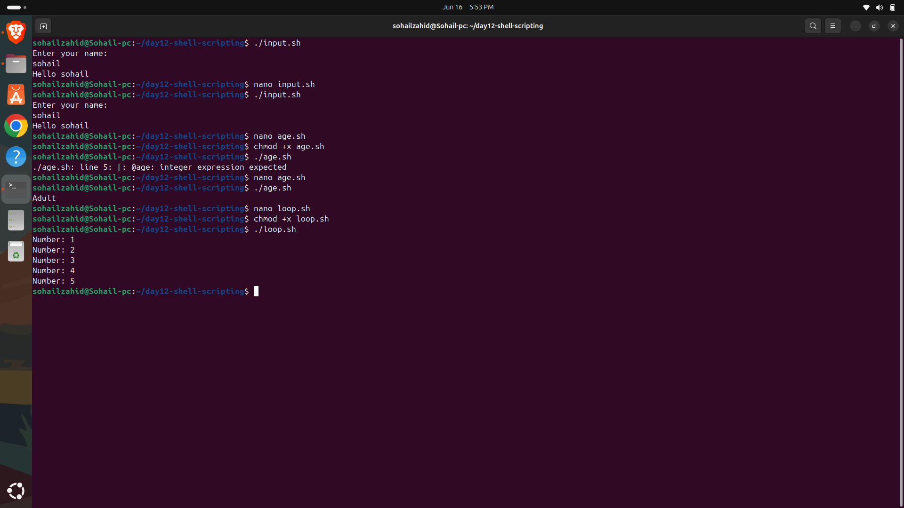
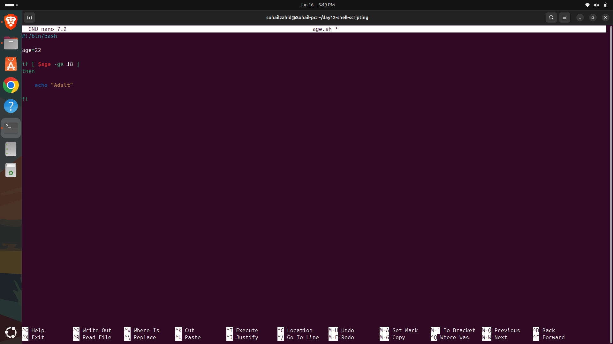

# Day 12 - Shell Scripting Fundamentals

## Objective

Learn the fundamentals of Bash scripting and automation.

---

## Topics Covered

- Script Structure
- Variables
- User Input
- Conditional Statements

---

## Commands Practiced

```bash
echo
read
if
elif
else
```

---

## Key Learnings

- Creating executable scripts
- Using variables and inputs
- Writing decision-making logic
- Automating repetitive tasks

---

## Outcome

Successfully created basic Bash scripts for automation tasks.


---


---

## Screenshots

### sysInfonano.png



### loopNano.png


### sysInfo.png



### Script2.png



### FirstScript.png



### Demoscript.png



### ageScript.png



### loopScript.png



### ageFile.png



