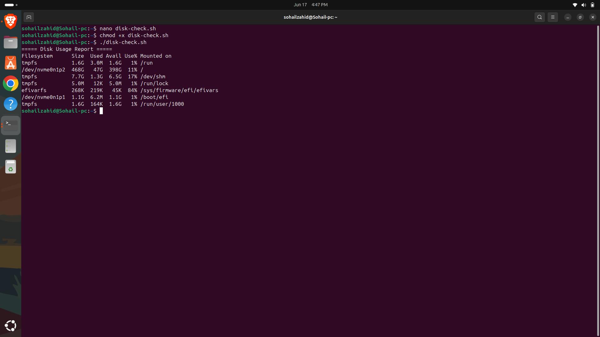
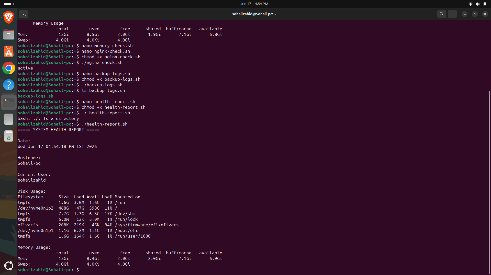
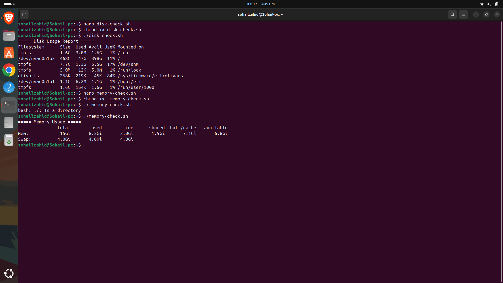
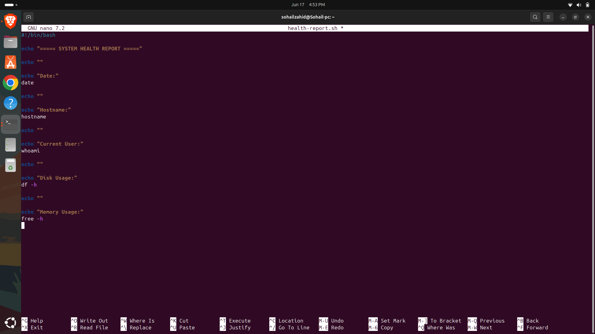
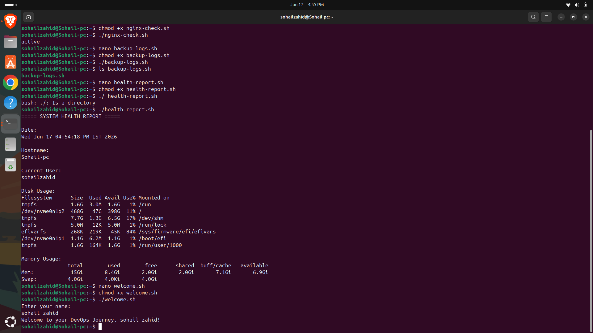
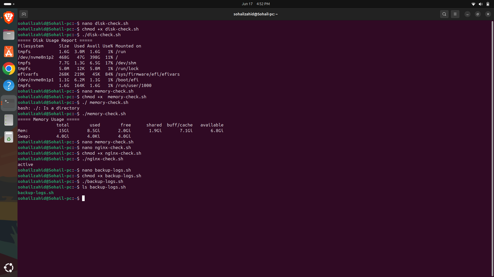

# Day 13 - Shell Scripting Practice

## Objective

Apply Bash scripting concepts through practical automation exercises.

---

## Topics Covered

- Loops
- Functions
- Automation Scripts
- Error Handling

---

## Commands Practiced

```bash
for
while
case
function
exit
```

---

## Key Learnings

- Building reusable scripts
- Automating administrative tasks
- Implementing loops and functions
- Improving scripting efficiency

---

## Outcome

Successfully developed practical automation scripts using Bash.


---


---

## Screenshots

### diskcheck.png



### healthreport.png



### memorycheck.png



### healthreportTerminal.png



### welcome.sh.png



### nginxcheck.png



