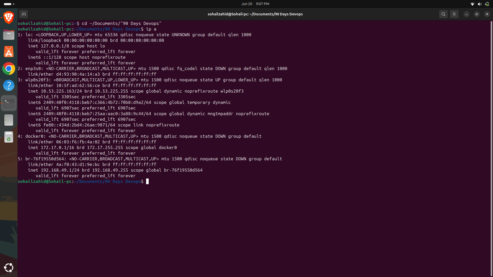
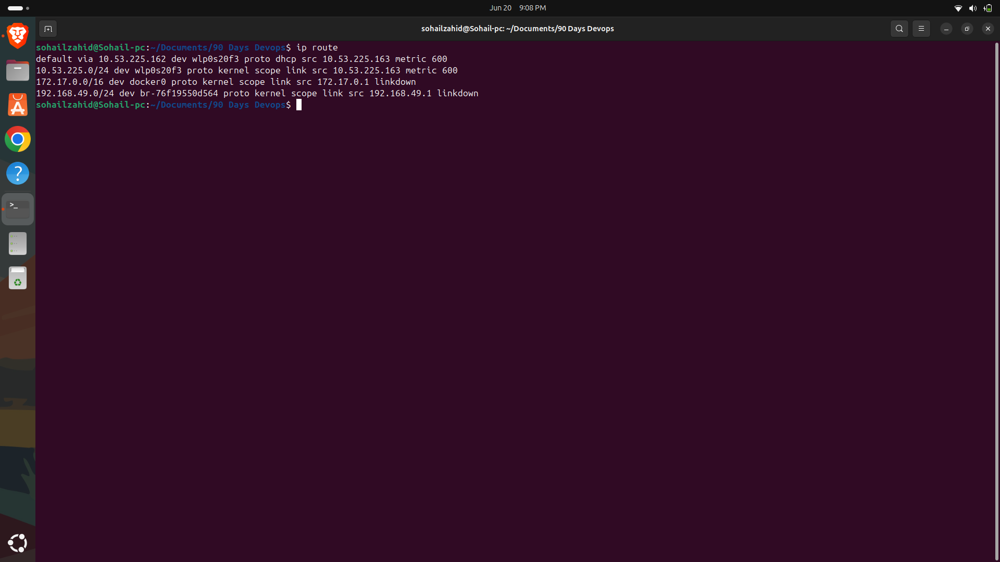
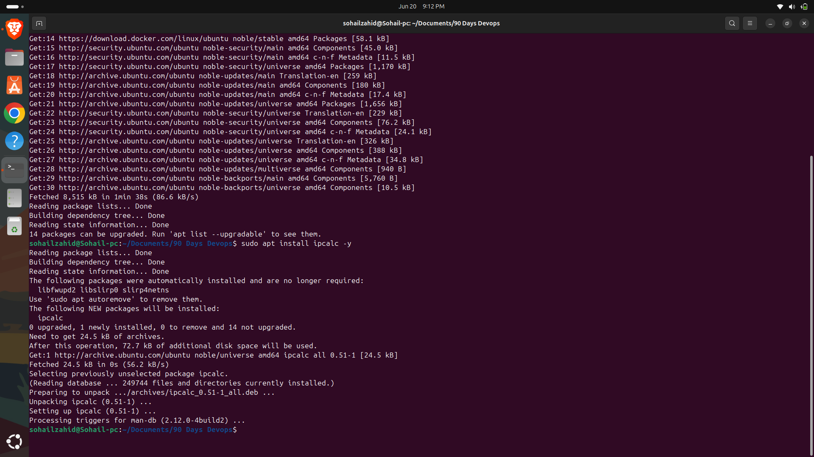
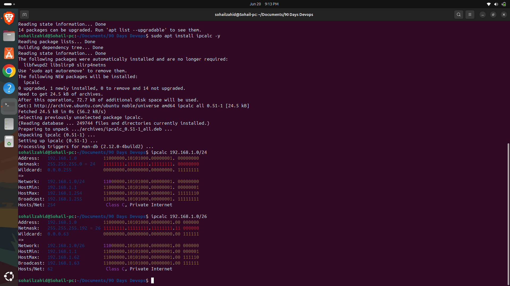
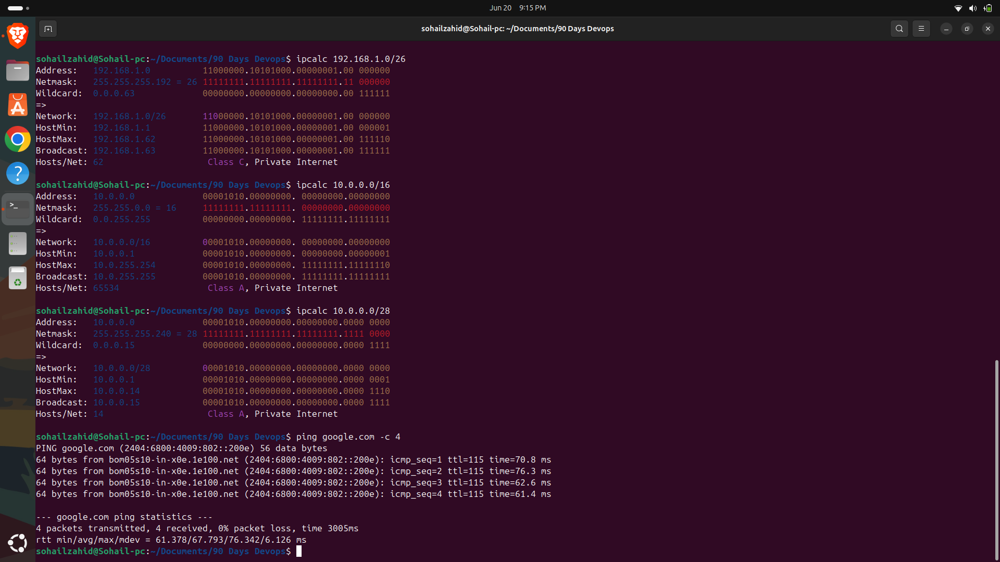

# Day 17 - Subnetting Fundamentals

## Objective

Learn how subnetting works and understand how networks are divided into smaller logical networks.

## Topics Covered

* What is Subnetting
* Importance of Subnetting
* IP Address Structure
* Network and Host Portions
* Subnet Masks
* CIDR Notation
* Network Address
* Broadcast Address
* Host Calculation

## What is Subnetting?

Subnetting is the process of dividing a large network into smaller logical networks called subnets.

### Benefits

* Efficient IP address management
* Better security
* Improved network performance
* Easier troubleshooting
* Better scalability

## Why Subnetting Matters in DevOps

Subnetting is widely used in:

* AWS VPC Design
* Kubernetes Networking
* Docker Networking
* Load Balancers
* Firewall Rules
* Cloud Infrastructure

## Commands Practiced

### Check IP Address

```bash
ip a
```

### View Routing Table

```bash
ip route
```

### Display Network Interfaces

```bash
ip link
```

### Test Connectivity

```bash
ping google.com -c 4
```

### Calculate Subnet Information

```bash
ipcalc 192.168.1.0/24
```

## Key Learnings

* Subnetting divides networks into smaller manageable segments.
* CIDR notation defines network size.
* Subnet masks separate network and host portions.
* Subnetting is essential for cloud and enterprise networking.
* Understanding subnetting is important for DevOps and Cloud Engineers.

## Practical Work

### Routing Table



### IP Route



### Subnet Calculation



### Additional Subnet Practice



### Connectivity Test



## Outcome

Successfully practiced subnet calculations using Linux networking tools and gained a better understanding of network design concepts used in DevOps and Cloud environments.
