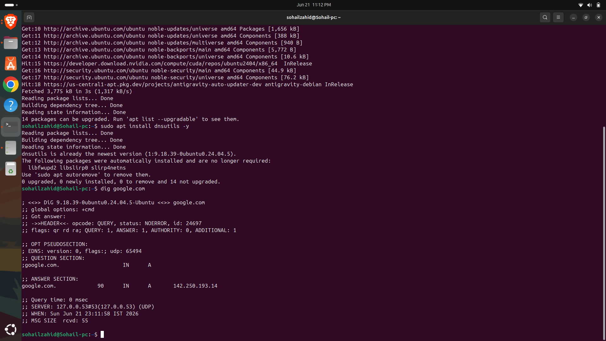
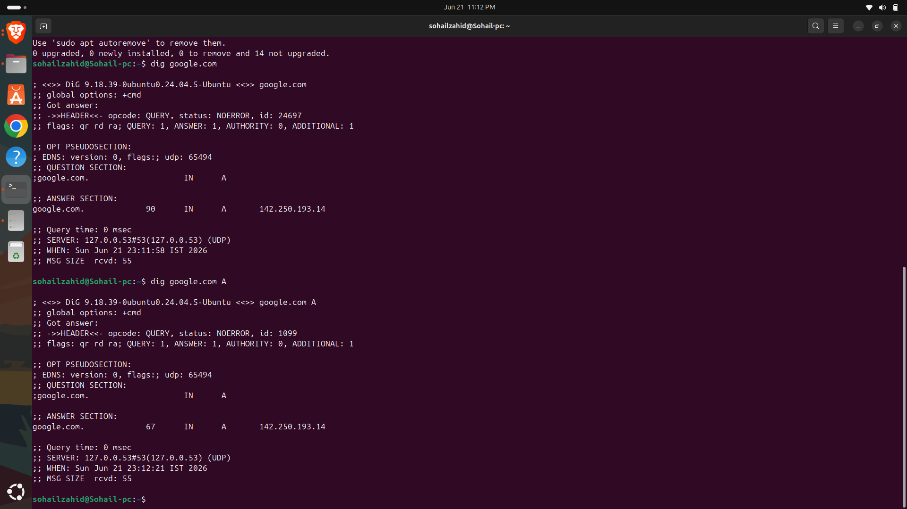
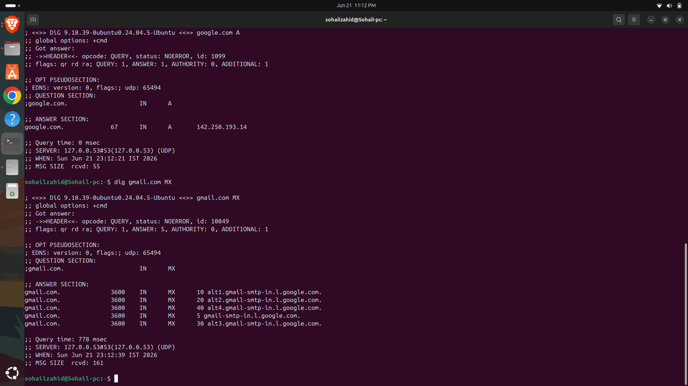
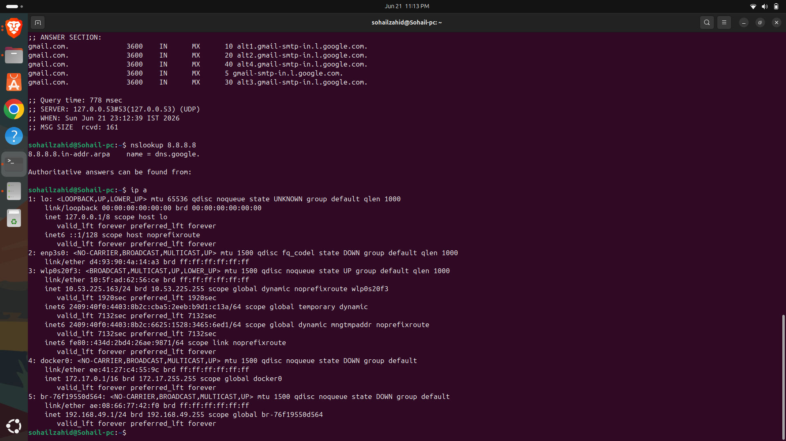

# Day 18 - DNS & DHCP Fundamentals

## Objective

Understand how DNS and DHCP work, how devices communicate over networks, and why these services are critical in cloud and DevOps environments.

---

## Topics Covered

* DNS Fundamentals
* DNS Resolution Process
* DNS Records
* DHCP Fundamentals
* Static vs Dynamic IP Addresses
* Reverse DNS Lookup
* Public and Private DNS

---

## What is DNS?

DNS (Domain Name System) translates human-readable domain names into IP addresses.

Example:

google.com → 142.250.x.x

Without DNS, users would need to remember IP addresses instead of domain names.

---

## DNS Resolution Process

1. User enters a domain name.
2. DNS Resolver receives the request.
3. Root DNS Server is queried.
4. TLD Server is queried.
5. Authoritative DNS Server responds.
6. IP address is returned to the client.

---

## Common DNS Records

### A Record

Maps a domain name to an IPv4 address.

### AAAA Record

Maps a domain name to an IPv6 address.

### MX Record

Used for email routing.

### CNAME Record

Creates an alias for another domain.

### TXT Record

Stores verification and configuration information.

---

## What is DHCP?

DHCP (Dynamic Host Configuration Protocol) automatically assigns IP addresses to devices.

It provides:

* IP Address
* Subnet Mask
* Default Gateway
* DNS Server

Without DHCP, network configuration would need to be performed manually.

---

## Static vs Dynamic IP

| Static IP            | Dynamic IP              |
| -------------------- | ----------------------- |
| Fixed Address        | Changes Automatically   |
| Used for Servers     | Used for Client Devices |
| Manual Configuration | DHCP Configuration      |

---

## Commands Practiced

### DNS Lookup

```bash
nslookup google.com
```

### Detailed DNS Query

```bash
dig google.com
```

### Query A Record

```bash
dig google.com A
```

### Query MX Record

```bash
dig gmail.com MX
```

### Reverse DNS Lookup

```bash
nslookup 8.8.8.8
```

### Check Assigned IP

```bash
ip a
```

---

## Screenshots

## DNS Lookup


## Dig Query



## A Record



## MX Record



## IP Address



### DHCP Assigned IP

---

## Key Learnings

* DNS converts domain names into IP addresses.
* DHCP automates network configuration.
* DNS records serve different networking purposes.
* Reverse DNS helps identify hosts from IP addresses.
* DNS and DHCP are essential services in cloud environments.

---

## DevOps Connection

DNS and DHCP are widely used in:

* AWS Route 53
* Kubernetes Services
* Load Balancers
* Cloud Infrastructure
* Service Discovery
* Enterprise Networking

---

## Outcome

Successfully explored DNS and DHCP fundamentals and gained practical experience with DNS resolution, record lookups, and IP address assignment.
