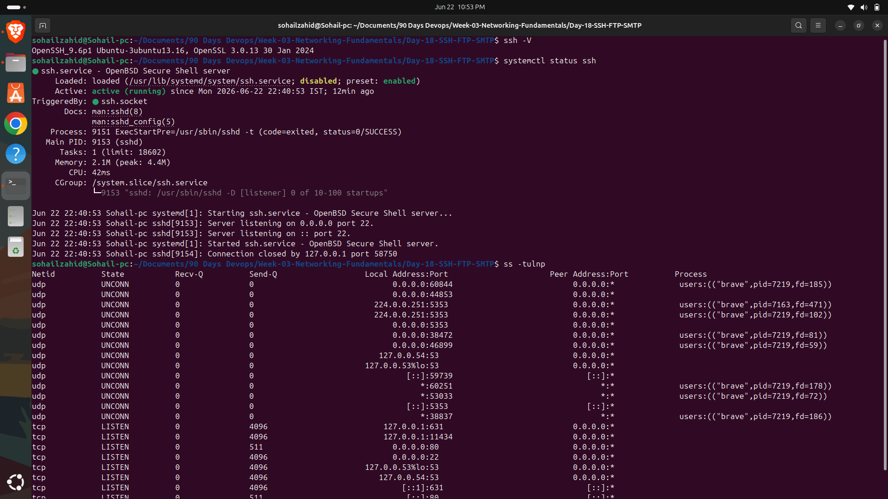
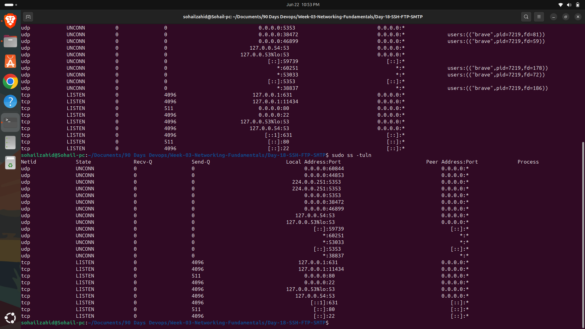

# Day 19 - SSH, FTP & SMTP Fundamentals

## Overview

Today I learned about SSH, FTP, and SMTP, three essential protocols used in networking, system administration, and DevOps environments.

---

## SSH (Secure Shell)

SSH is a secure protocol used to remotely access and manage servers over a network.

### Features

- Encrypted communication
- Remote server management
- Secure file transfers using SCP/SFTP
- Authentication using passwords or SSH keys

### Default Port

| Protocol | Port |
|-----------|------|
| SSH | 22 |

### Example

```bash
ssh username@server-ip
```

---

## FTP (File Transfer Protocol)

FTP is used to transfer files between systems over a network.

### Features

- Upload and download files
- Client-server architecture
- Commonly used for file sharing

### Default Port

| Protocol | Port |
|-----------|------|
| FTP | 21 |

### Note

FTP does not encrypt data. Secure alternatives include:

- SFTP
- FTPS

---

## SMTP (Simple Mail Transfer Protocol)

SMTP is used to send emails between mail servers and email clients.

### Uses

- Sending notifications
- Alert emails
- Password reset emails
- Monitoring alerts

### Default Ports

| Protocol | Port |
|-----------|------|
| SMTP | 25 |
| SMTP Submission | 587 |
| SMTPS | 465 |

---

## Common Network Ports

| Service | Port |
|----------|------|
| SSH | 22 |
| FTP | 21 |
| HTTP | 80 |
| HTTPS | 443 |
| SMTP | 25 |
| DNS | 53 |

---

## Commands Practiced

### Check SSH Version

```bash
ssh -V
```

### Check SSH Service Status

```bash
systemctl status ssh
```

### View Open Ports

```bash
ss -tulnp
```

### Display Listening Services

```bash
sudo ss -tuln
```

### View SSH Configuration

```bash
cat /etc/ssh/ssh_config
```

---

## Screenshots

### SSH Version, SSH Status and Open Ports



### Network Services



---

## Key Takeaways

- Learned secure remote server access using SSH.
- Understood file transfer using FTP.
- Explored email transmission through SMTP.
- Identified commonly used networking ports.
- Practiced Linux networking and service management commands.

---

## Skills Gained

- Linux Networking
- SSH Administration
- Network Services
- Protocol Fundamentals
- System Administration
- DevOps Foundations
