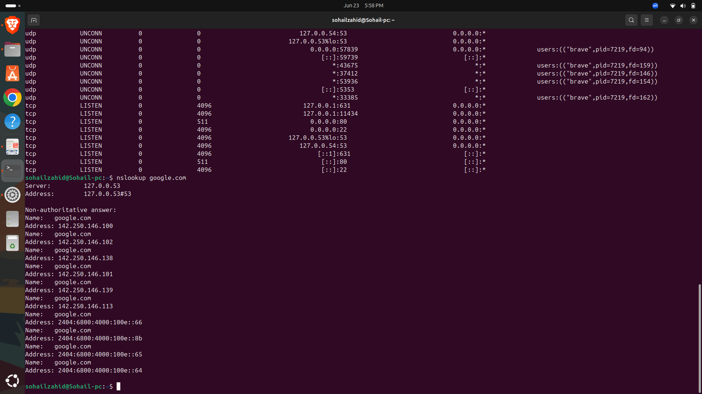
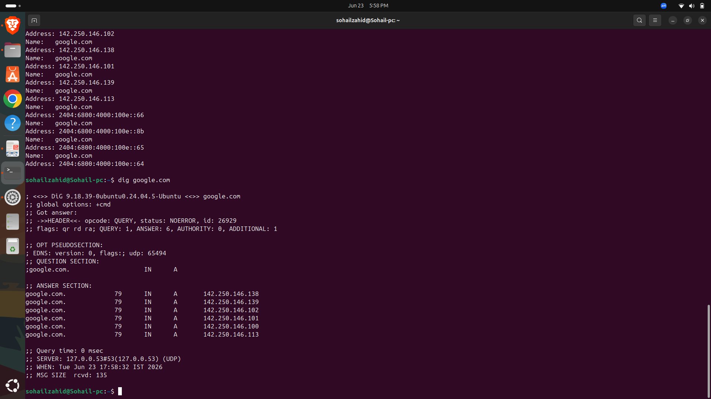
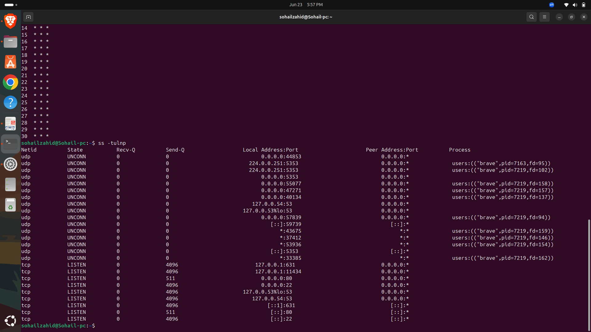
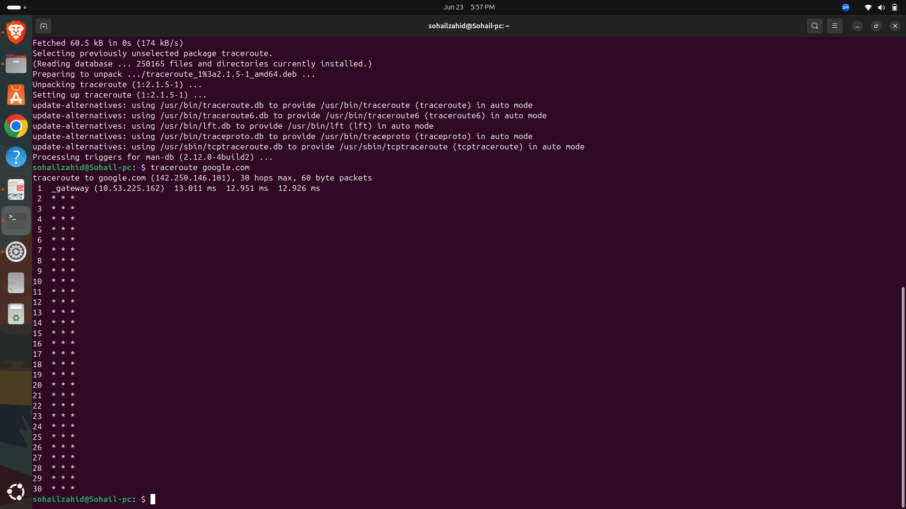
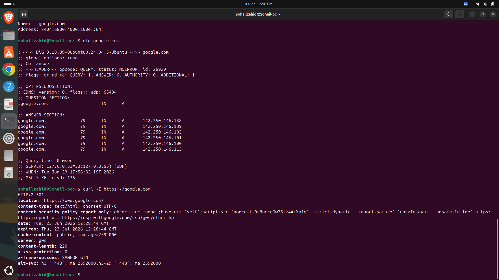

# Day 20 - Network Troubleshooting Fundamentals

## Objective

Learn how to identify, diagnose, and troubleshoot common network connectivity issues using Linux networking tools.

---

## Topics Covered

* Connectivity Testing
* Route Analysis
* DNS Troubleshooting
* Open Ports Analysis
* HTTP Connectivity Testing
* Troubleshooting Workflow

---

## Why Network Troubleshooting Matters

Network troubleshooting is a critical skill for DevOps Engineers because applications, servers, containers, and cloud services depend on reliable network communication.

Common issues include:

* DNS failures
* Routing problems
* Firewall restrictions
* Service outages
* Connectivity issues

---

## Commands Practiced

### Ping

```bash
ping google.com -c 4
```

Tests network connectivity.

### Traceroute

```bash
traceroute google.com
```

Displays the path packets take through the network.

### Open Ports

```bash
ss -tulnp
```

Displays listening services and ports.

### DNS Lookup

```bash
nslookup google.com
```

Checks DNS resolution.

### Detailed DNS Query

```bash
dig google.com
```

Provides detailed DNS information.

### HTTP Connectivity Test

```bash
curl -I https://google.com
```

Tests web server response headers.

---

## Screenshots

## DNS Lookup



## Dig Query



## Open Ports



## Traceroute



## Curl Test




---

## Key Learnings

* Ping verifies connectivity.
* Traceroute identifies routing issues.
* DNS tools help resolve name resolution problems.
* ss displays active listening ports.
* curl verifies website accessibility.

---

## DevOps Connection

These tools are widely used in:

* Linux Administration
* Cloud Infrastructure
* Kubernetes Networking
* AWS Troubleshooting
* Containerized Applications
* Production Incident Management

---

## Outcome

Successfully practiced essential network troubleshooting techniques and gained hands-on experience diagnosing common connectivity issues.

