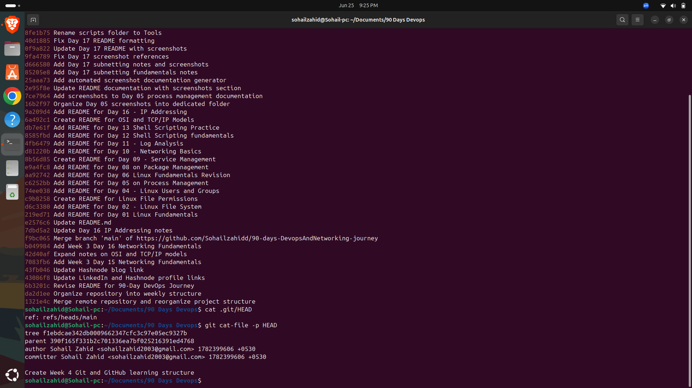
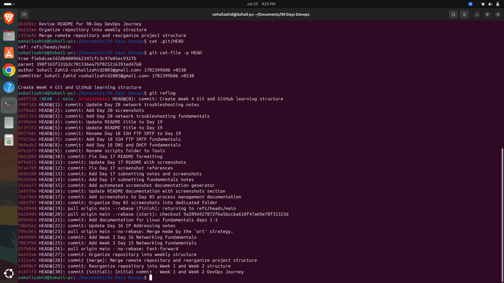

# 🚀 Day 22 - Git Internals & Advanced Git Workflow

## Objective

Learn how Git works internally and understand advanced Git concepts used in real-world development and DevOps environments.

---

## Topics Covered

* Git Architecture
* Git Objects
* HEAD Reference
* Git Log
* Git Reflog
* Git Diff
* Git Restore

---

## What is Git?

Git is a distributed version control system that helps developers track changes in source code, collaborate efficiently, and maintain project history.

Unlike traditional systems, Git stores snapshots of files instead of tracking individual file changes.

---

## Understanding Git Internals

Git stores data using three main object types:

### Blob

Stores file content.

### Tree

Stores directory structure.

### Commit

Stores a snapshot of the project along with metadata.

---

## Understanding HEAD

HEAD is a pointer that references the current branch and latest commit.

Command used:

```bash
cat .git/HEAD
```

Example output:

```text
ref: refs/heads/main
```

---

## Commands Practiced

### View Commit History

```bash
git log --oneline
```

Displays a compact view of commit history.

### Check Current HEAD

```bash
cat .git/HEAD
```

Displays the current branch reference.

### View Reflog

```bash
git reflog
```

Shows historical movements of HEAD.

### Inspect Commit Object

```bash
git cat-file -p HEAD
```

Displays detailed commit information.

### Compare Changes

```bash
git diff
```

Shows modifications before committing.

### Restore Changes

```bash
git restore README.md
```

Restores uncommitted changes.

---

## Key Learnings

* Git stores project snapshots using objects.
* HEAD points to the active branch.
* Reflog helps recover lost work.
* Diff helps review changes before committing.
* Git internals provide deeper understanding of version control workflows.

---

## DevOps Connection

Git is the foundation of modern DevOps practices and is heavily used in:

* GitHub Actions
* Jenkins Pipelines
* Infrastructure as Code
* CI/CD Automation
* Kubernetes Configuration Management

Understanding Git internals improves troubleshooting and collaboration skills.

---

## Outcome

Successfully explored Git internals, commit history, object storage, and repository management concepts used in professional software development workflows.

---

# Screenshots

## Git Commit History


## HEAD Reference


## Git Reflog



## Git Object Inspection



