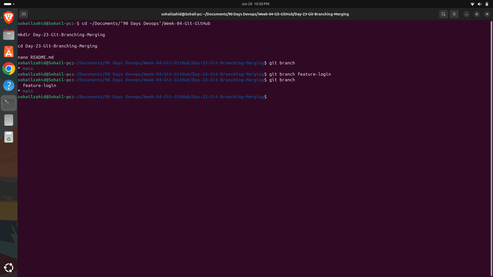
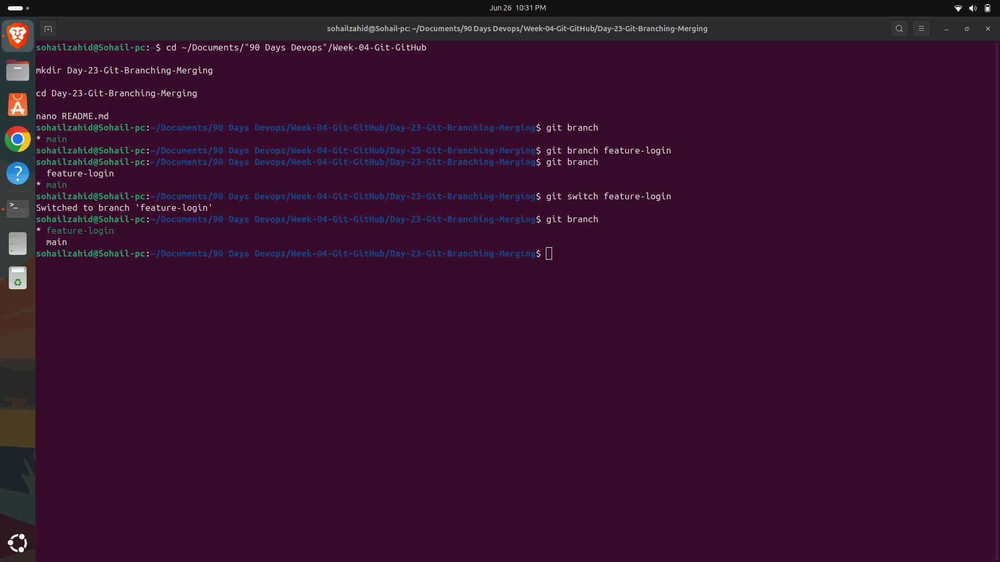
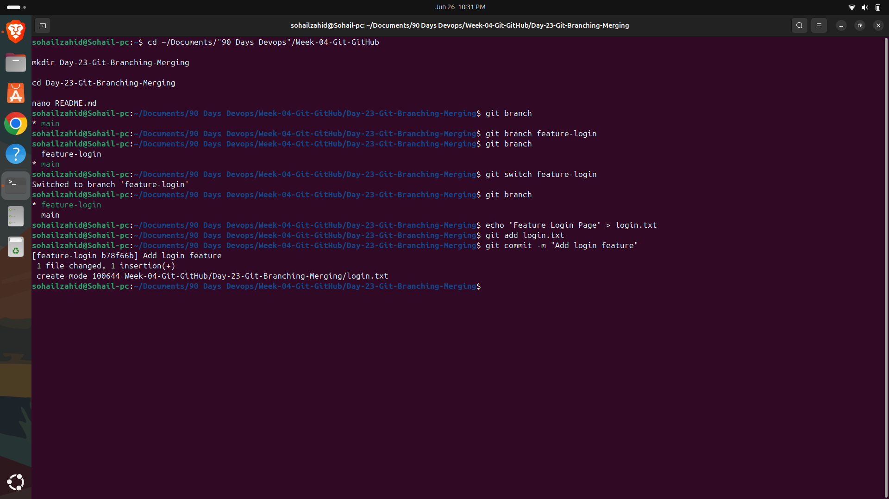
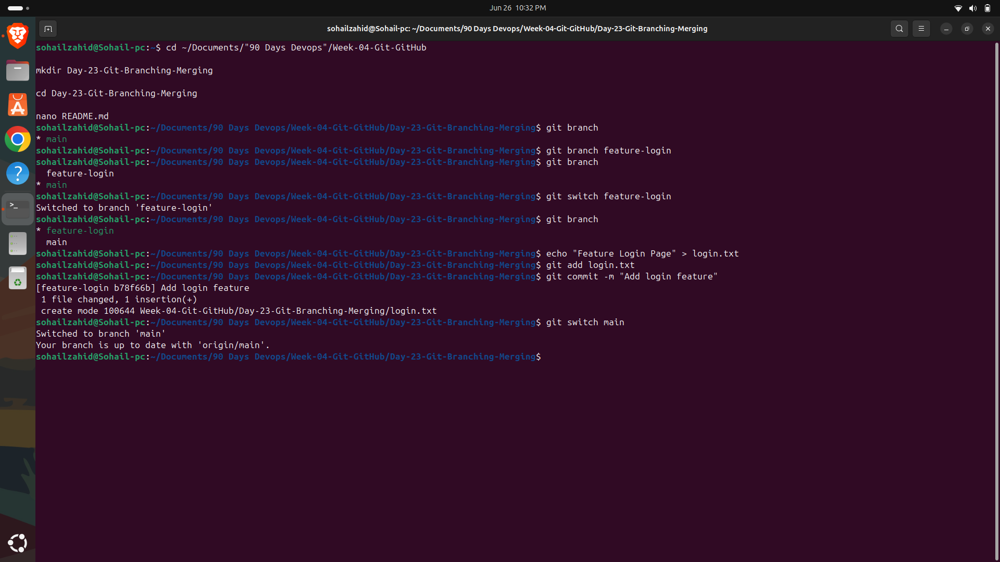
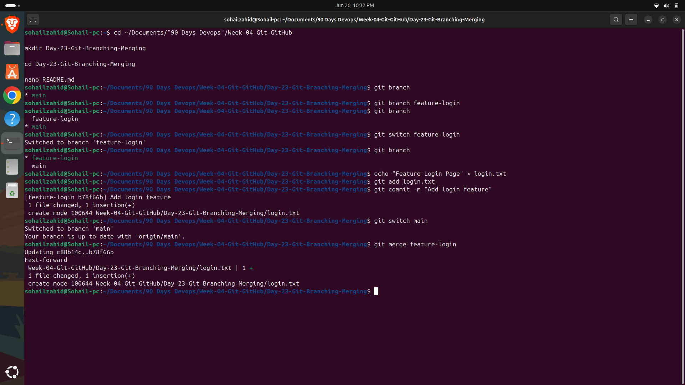
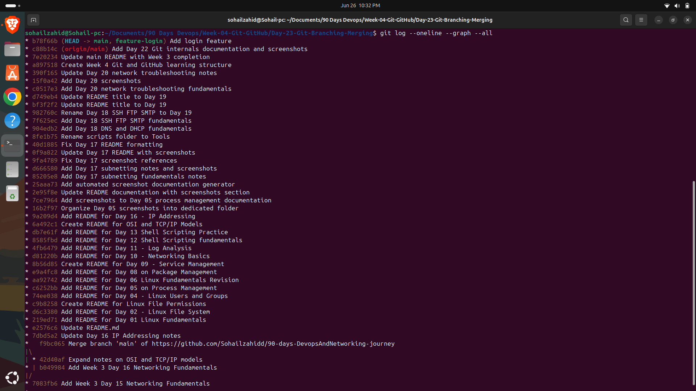

# 🚀 Day 23 - Git Branching & Merging

## Objective

Learn how Git branching works, create and switch between branches, merge changes, and understand how branching enables collaborative software development.

---

## Topics Covered

* Git Branches
* Creating Branches
* Switching Branches
* Feature Development
* Merging Branches
* Viewing Branch History
* Deleting Branches

---

## What is Git Branching?

A branch in Git is an independent line of development.

Branching allows developers to work on new features, bug fixes, or experiments without affecting the main project.

Once the work is completed and tested, it can be merged back into the main branch.

---

## Why Branching is Important

Git branching provides several benefits:

* Isolates new features from the main project
* Enables multiple developers to work simultaneously
* Simplifies collaboration
* Reduces the risk of breaking production code
* Supports modern Git workflows

---

## Commands Practiced

### View Existing Branches

```bash
git branch
```

Displays all local branches.

---

### Create a New Branch

```bash
git branch feature-login
```

Creates a new branch without switching to it.

---

### Switch to Another Branch

```bash
git switch feature-login
```

Moves from the current branch to the specified branch.

---

### Verify Current Branch

```bash
git branch
```

The active branch is marked with an asterisk (*).

---

### Commit Changes

```bash
git add .

git commit -m "Add login feature"
```

Saves changes made in the feature branch.

---

### Merge Branch

```bash
git switch main

git merge feature-login
```

Combines the feature branch into the main branch.

---

### View Branch History

```bash
git log --oneline --graph --all
```

Displays the complete commit history in graph format.

---

### Delete Branch

```bash
git branch -d feature-login
```

Deletes the branch after it has been successfully merged.

---

## Key Learnings

* Git branches isolate development work.
* Switching branches allows parallel development.
* Merging combines completed work into the main branch.
* Branch history helps visualize project development.
* Branching is fundamental to collaborative software development.

---

## DevOps Connection

Git branching plays a crucial role in modern DevOps practices:

* Feature Development
* Pull Request Workflows
* CI/CD Pipelines
* GitHub Actions
* Infrastructure as Code
* Team Collaboration
* Release Management

Understanding Git branching is essential for working in professional software development and DevOps environments.

---

## Outcome

Successfully created, switched, merged, and deleted Git branches while understanding how branching supports collaborative development and efficient version control.

---

# Screenshots

## Git Branch



## Create Branch



## Switch Branch



## Feature Commit



## Git Merge



## Git Graph


