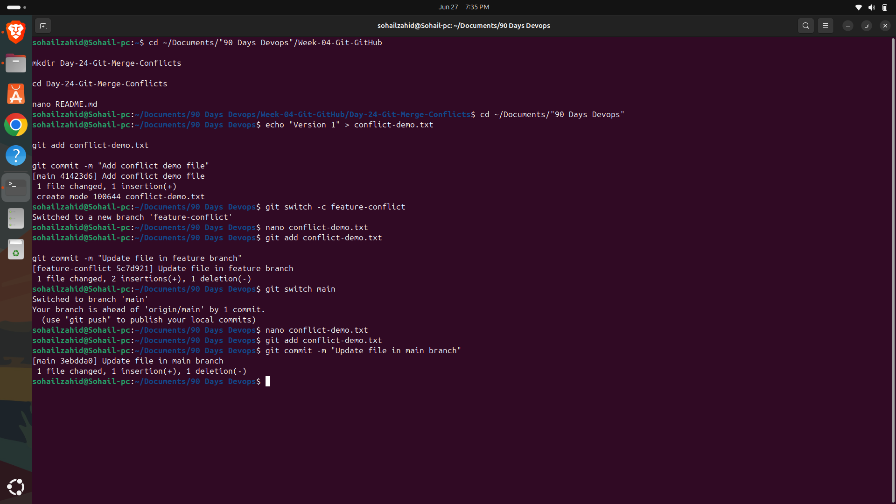
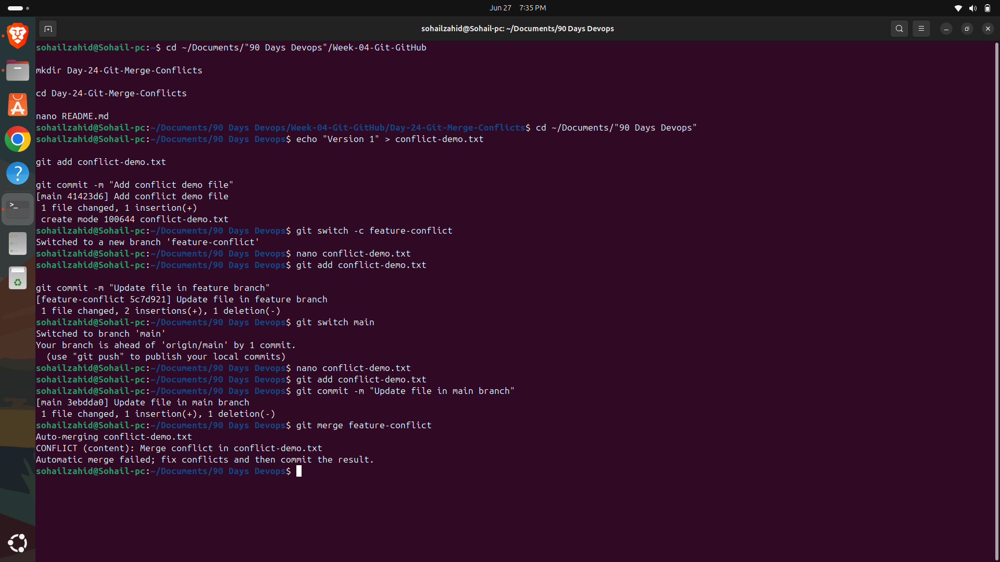
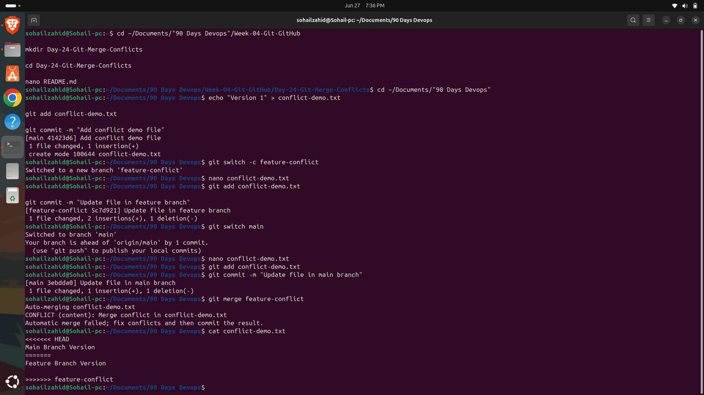
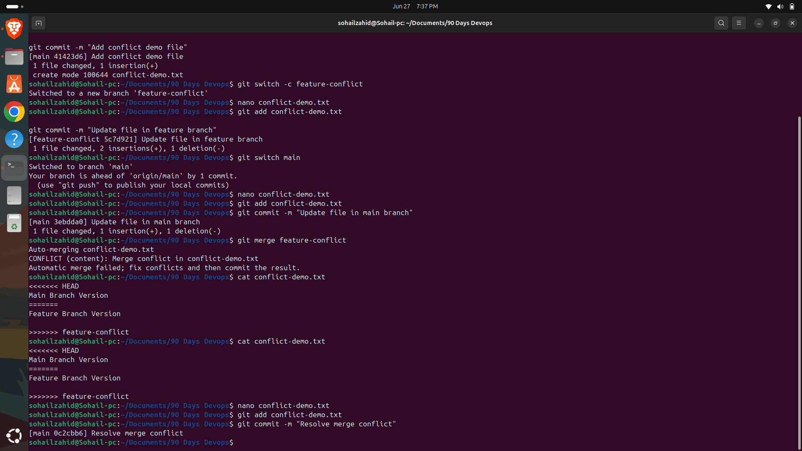

# 🚀 Day 24 - Git Merge Conflicts & Conflict Resolution

## Objective

Learn what Git merge conflicts are, why they occur, and how to resolve them using Git commands and best practices.

---

## Topics Covered

* Git Merge Conflicts
* Conflict Markers
* Resolving Conflicts
* Git Status
* Git Add
* Git Commit
* Git Log Graph

---

## What is a Merge Conflict?

A merge conflict occurs when Git cannot automatically combine changes from two different branches.

This usually happens when the same file or the same lines of code have been modified in different branches before merging.

Instead of guessing which version to keep, Git asks the developer to resolve the conflict manually.

---

## Why Merge Conflicts Occur

Merge conflicts commonly happen when:

* Two developers edit the same file.
* The same line of code is modified in different branches.
* Files are renamed or deleted differently.
* Long-running branches are merged after significant changes.

Resolving conflicts correctly ensures that important code changes are not lost.

---

## Commands Practiced

### Create a New Branch

```bash
git switch -c feature-conflict
```

Creates and switches to a new feature branch.

---

### Check Repository Status

```bash
git status
```

Displays the current state of the repository and identifies conflicted files.

---

### Merge Branch

```bash
git merge feature-conflict
```

Attempts to merge the feature branch into the current branch.

---

### View Conflict Markers

```bash
cat conflict-demo.txt
```

Displays Git conflict markers inside the file.

---

### Resolve the Conflict

Edit the file manually using Nano:

```bash
nano conflict-demo.txt
```

Remove the conflict markers and keep the correct content.

---

### Stage the Resolved File

```bash
git add conflict-demo.txt
```

Marks the conflict as resolved.

---

### Complete the Merge

```bash
git commit -m "Resolve merge conflict"
```

Creates a new commit after resolving the conflict.

---

### View Commit Graph

```bash
git log --oneline --graph --all
```

Displays the repository history and merge commits.

---

## Key Learnings

* Merge conflicts are a normal part of collaborative development.
* Git highlights conflicts instead of making incorrect assumptions.
* Conflict markers identify competing changes.
* Manual conflict resolution preserves the correct version of the code.
* Git records the resolved merge as a new commit.

---

## DevOps Connection

Understanding merge conflicts is essential in modern DevOps workflows because teams frequently work on the same repositories.

Merge conflict resolution is widely used in:

* GitHub Pull Requests
* GitLab Merge Requests
* CI/CD Pipelines
* Infrastructure as Code
* Team Collaboration
* Software Release Management

Efficient conflict resolution helps maintain code quality and supports smooth collaboration across development teams.

---

## Outcome

Successfully created a merge conflict, understood Git conflict markers, resolved the conflict manually, and completed the merge while gaining practical experience with collaborative Git workflows.

---

# Screenshots

## Screenshots

### Initial Commit


### Feature Branch


### Feature Commit


### Main Commit


### Merge Conflict


### Conflict Markers


### Final Git Graph

