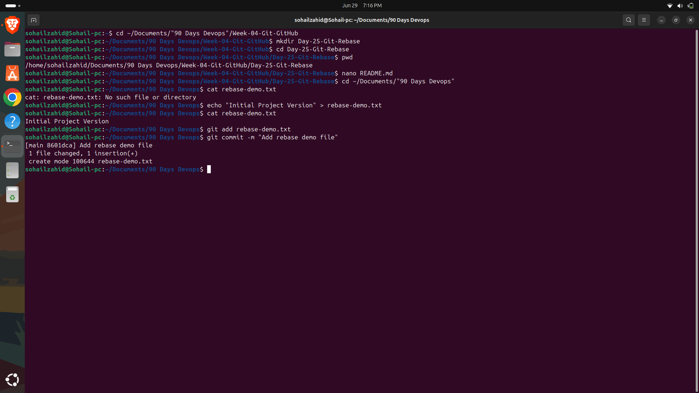
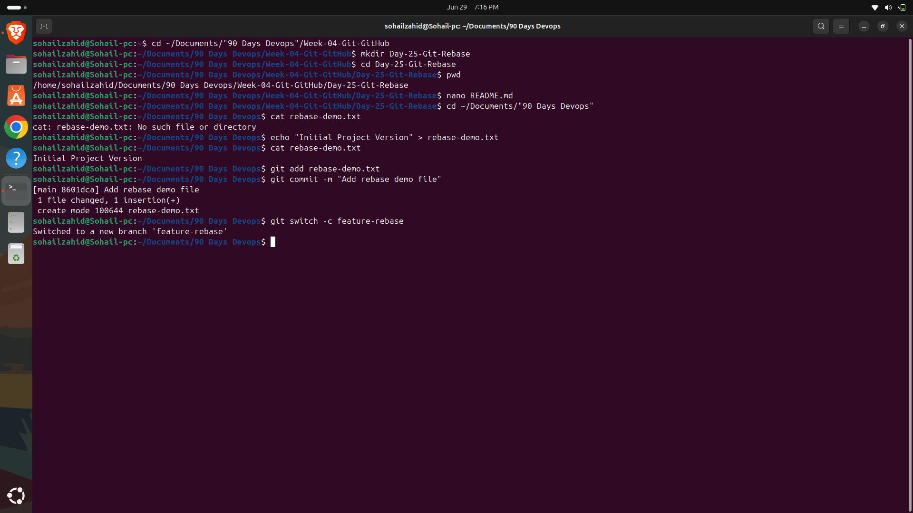
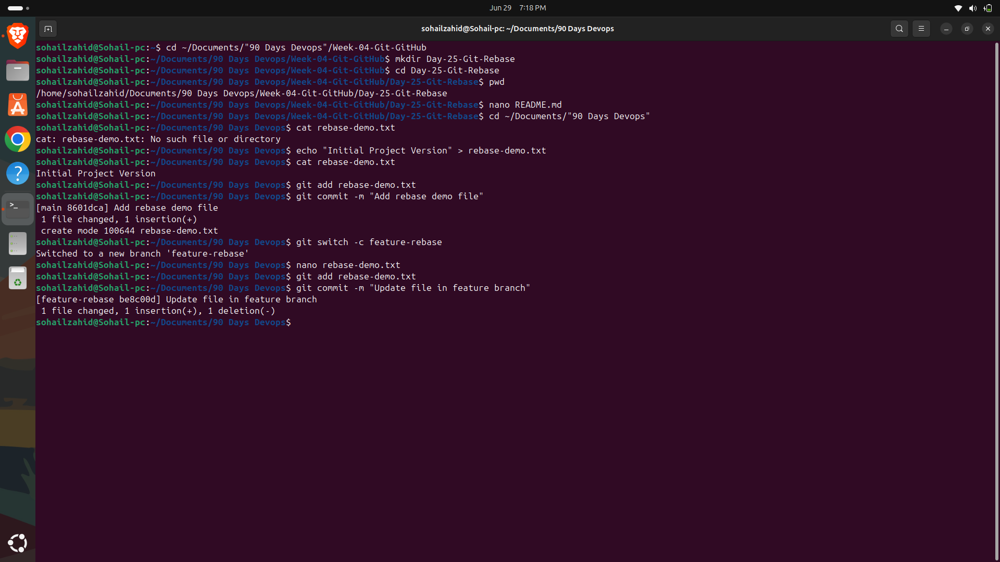
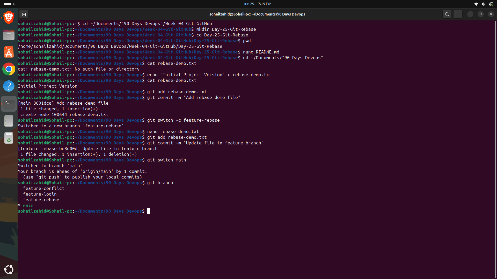
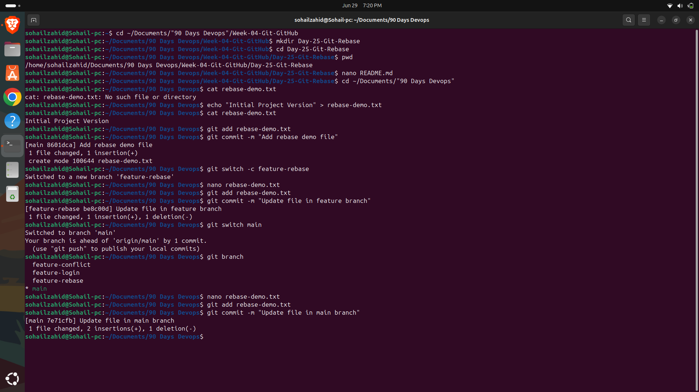
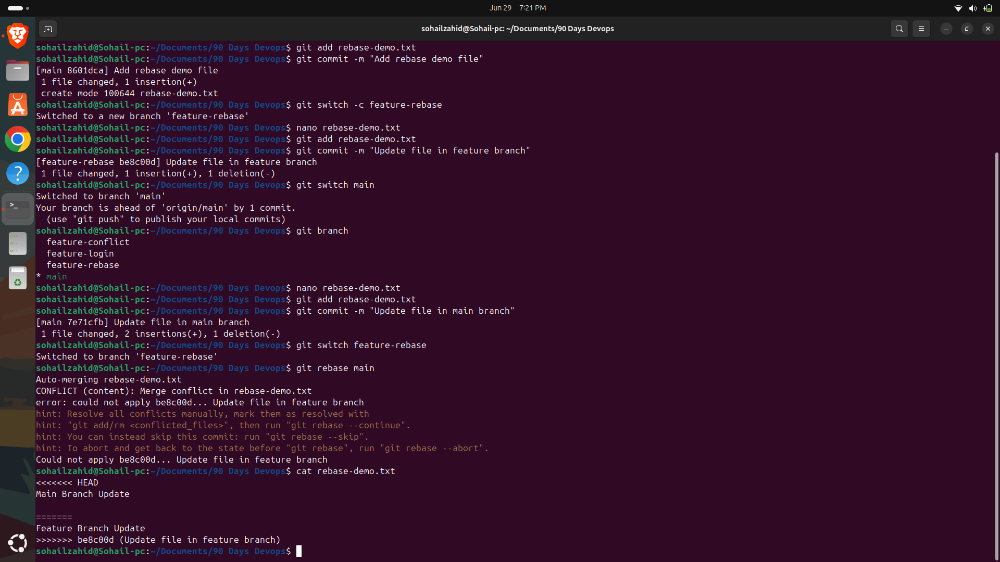
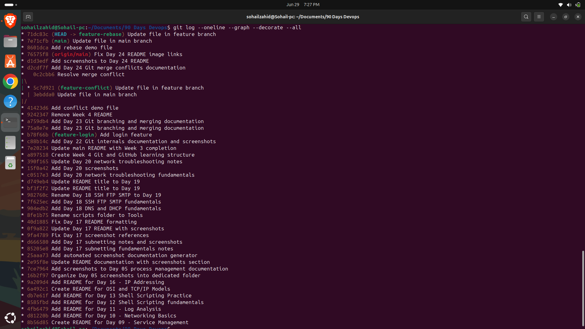

# Day 25 – Git Rebase

## Objective

Today I learned how Git Rebase works and how it differs from Git Merge.

## Topics Covered

- Git Rebase
- Linear Commit History
- Rewriting Commit History
- Fast-forward Rebase
- Comparing Merge vs Rebase

## Commands Practiced

```bash
git switch -c feature-rebase
git add
git commit
git switch main
git rebase feature-rebase
git log --oneline --graph --all
```

## What I Learned

Git Rebase moves commits from one branch onto another to create a cleaner and more linear project history.

Unlike merge, rebase does not create a merge commit.

---

# Screenshots

## Initial Commit



## Feature Branch



## Feature Branch Commit



## Main Branch Commit



## Rebase Conflict



## Conflict Markers



## Final Git History


