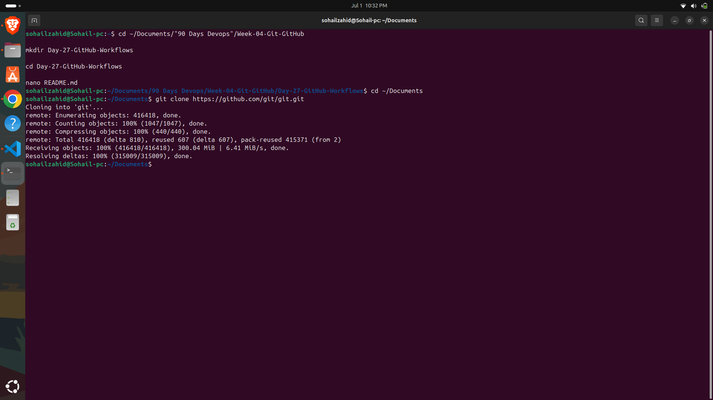
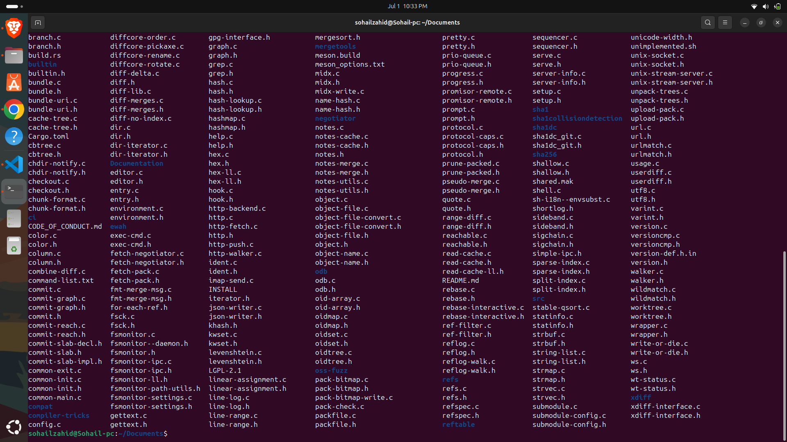
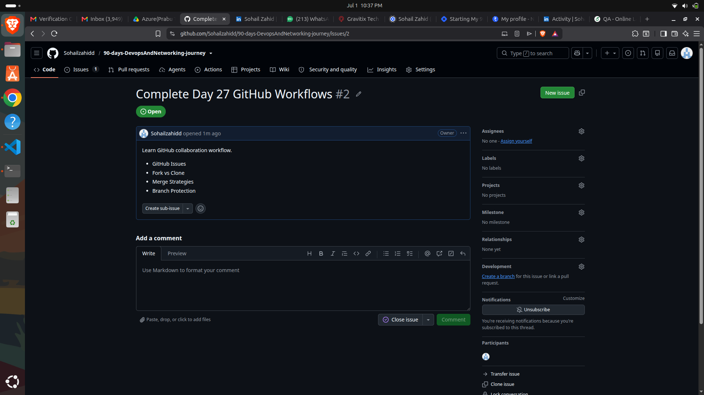

# 🚀 Day 27 - GitHub Workflows

## Benefits of Using GitHub Workflows

Implementing a structured GitHub workflow provides several advantages:

- Improves team collaboration
- Reduces merge conflicts
- Maintains a clean project history
- Makes code reviews easier
- Ensures higher code quality
- Supports continuous integration and deployment (CI/CD)

---

## Objective

Understand the professional GitHub workflow used in collaborative software development.

---

## Topics Covered

- GitHub Workflow
- Issues
- Fork vs Clone
- Pull Requests
- Code Review
- Merge Strategies
- Branch Protection

---

## GitHub Workflow

A typical GitHub workflow consists of:

1. Clone Repository
2. Create Feature Branch
3. Make Changes
4. Commit Changes
5. Push Branch
6. Open Pull Request
7. Review Changes
8. Merge into Main

---

## Real-World DevOps Usage

GitHub is widely used in DevOps pipelines to automate software delivery.

Typical workflow:

1. Developer pushes code to GitHub.
2. A Pull Request is created.
3. Team members review the code.
4. GitHub Actions automatically runs tests.
5. After approval, the Pull Request is merged.
6. CI/CD pipelines deploy the latest application.

This workflow ensures reliable, secure, and collaborative software development.
---

# Screenshots

## Folder Creation & README

## Git Clone

## GitHub Issue

