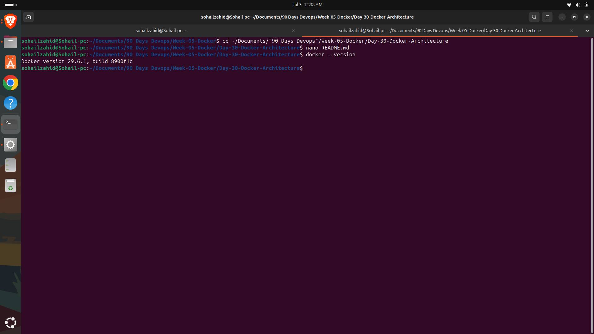
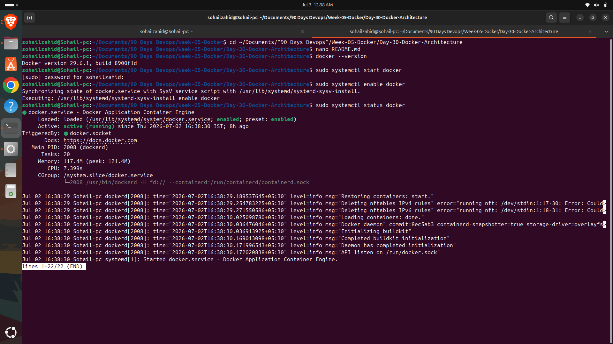
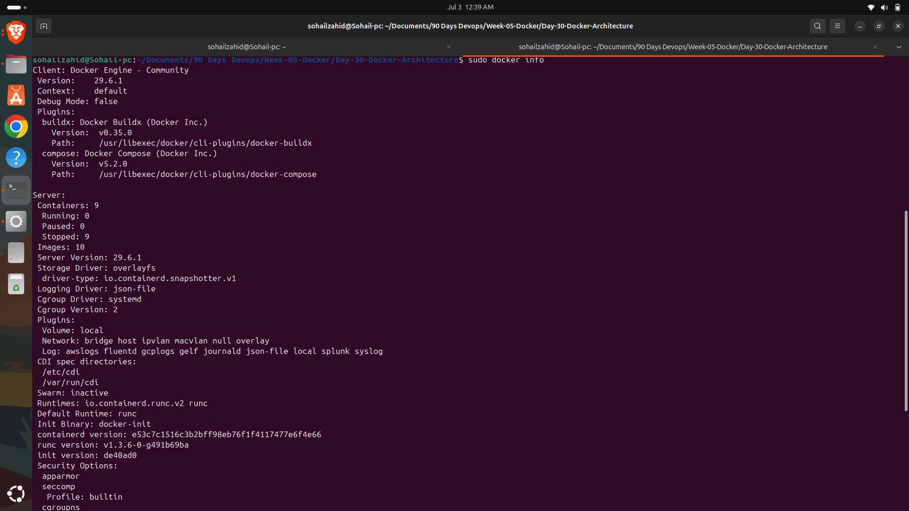

# Day 30 – Docker Architecture

## Week 5 – Docker Fundamentals

As part of my **90 Days DevOps & Networking Journey**, Day 30 focuses on understanding the architecture behind Docker and how its core components work together to build, distribute, and run containerized applications.

---

# Introduction

Docker follows a client-server architecture that simplifies application development, deployment, and management. Instead of installing applications directly on an operating system, Docker packages applications and their dependencies into containers, ensuring they run consistently across different environments.

Understanding Docker Architecture is the foundation for learning Docker because every Docker command interacts with one or more of its core components.

---

# Docker Client

The Docker Client is the command-line interface (CLI) used to interact with Docker.

Whenever a user executes commands such as:

```bash
docker build
docker pull
docker run
docker ps
docker images
```

the Docker Client sends requests to the Docker Daemon through the Docker REST API.

The client does not perform the work itself; it simply communicates with the Docker Engine.

---

# Docker Daemon

The Docker Daemon (`dockerd`) is the background service responsible for managing Docker objects.

Its responsibilities include:

- Building Docker Images
- Running Containers
- Managing Networks
- Managing Volumes
- Pulling Images from Docker Hub
- Removing Images and Containers

The daemon continuously listens for Docker API requests from the client.

---

# Docker Engine

Docker Engine is the main runtime environment that powers Docker.

It consists of three primary components:

- Docker Client
- Docker Daemon
- Docker REST API

Together, these components allow developers to create, manage, and deploy containerized applications efficiently.

---

# Docker Registry

A Docker Registry is a storage system used for Docker Images.

The most popular public registry is **Docker Hub**, which contains thousands of official and community-maintained images.

Organizations can also host private Docker Registries to securely store internal images.

---

# Docker Images

Docker Images are read-only templates that contain everything required to run an application.

A Docker Image includes:

- Application Source Code
- Runtime Environment
- Required Libraries
- Dependencies
- Configuration Files

Images are reusable and version-controlled, allowing developers to deploy applications consistently.

---

# Docker Containers

A Docker Container is a running instance of a Docker Image.

Containers provide isolated environments where applications execute independently while sharing the host operating system kernel.

Multiple containers can be created from the same Docker Image without affecting one another.

---

# Docker Workflow

The Docker workflow follows a simple process:

1. The developer executes a Docker command.
2. The Docker Client sends the request to the Docker Daemon.
3. The Docker Daemon checks whether the required image exists locally.
4. If the image is unavailable, Docker downloads it from Docker Hub.
5. Docker creates and starts the container from the image.
6. The application begins running inside the container.

---

# Docker Architecture Diagram

```
            Developer
                 │
                 ▼
         Docker Client
                 │
        Docker REST API
                 │
                 ▼
         Docker Daemon
          │          │
          ▼          ▼
   Docker Images   Containers
          │
          ▼
      Docker Hub
```

---

# Advantages of Docker Architecture

Docker Architecture offers several benefits:

- Lightweight application deployment
- Faster application startup
- Better resource utilization
- Platform independence
- Simplified software delivery
- Easy scalability
- Consistent development and production environments

---

# Key Takeaways

- Docker uses a Client-Server Architecture.
- The Docker Client communicates with the Docker Daemon.
- Docker Daemon manages images, containers, networks, and volumes.
- Docker Hub serves as the default public image registry.
- Docker Images are templates, while Containers are running instances of those images.
- Docker Engine combines the Docker Client, Daemon, and REST API to manage the complete container lifecycle.

---

# Conclusion

Docker Architecture provides the backbone for modern containerization. By understanding how Docker Client, Docker Daemon, Docker Engine, Docker Images, and Docker Containers work together, developers can efficiently build, distribute, and deploy applications across different environments.

This knowledge forms the foundation for the next topic, where I will begin working with **Docker Images and Containers** through practical hands-on exercises.

---

---

# Practical Commands Used

```bash
docker --version
```

```bash
sudo systemctl start docker
```

```bash
sudo systemctl enable docker
```

```bash
sudo systemctl status docker
```

```bash
sudo docker info
```

---

# Screenshots

## Docker Version



---

## Docker Service Status



---

## Docker Information



---

# Conclusion

Today I explored Docker Architecture and understood how Docker Client, Docker Engine, Docker Daemon, Docker Images, Docker Containers, and Docker Hub interact to provide a lightweight and efficient containerization platform. I also verified the Docker installation, started the Docker service, and inspected the Docker Engine using Docker CLI commands.
