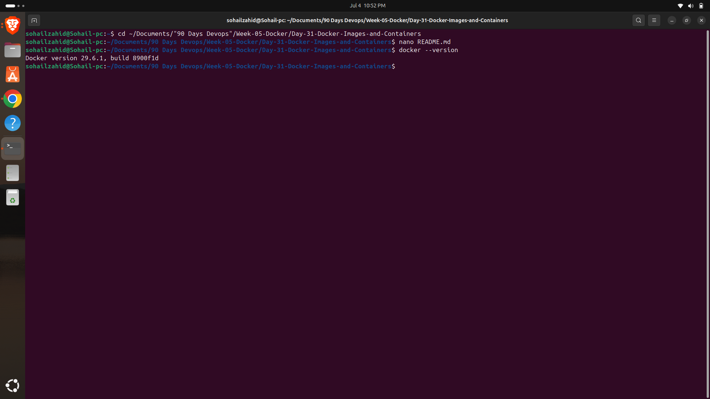
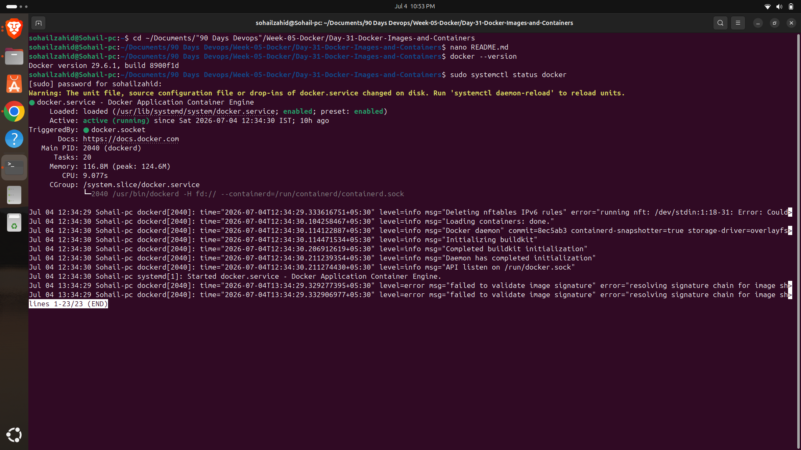
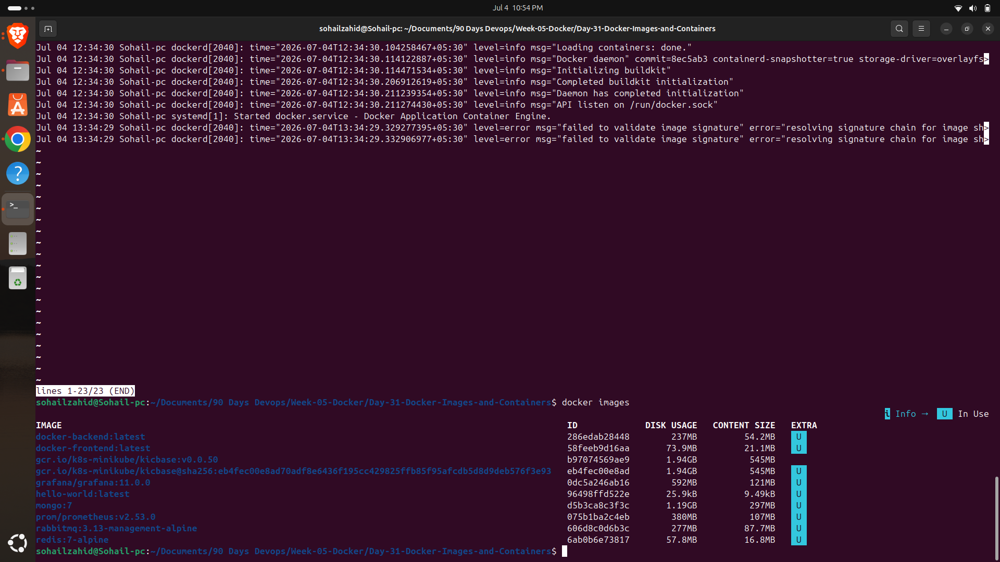
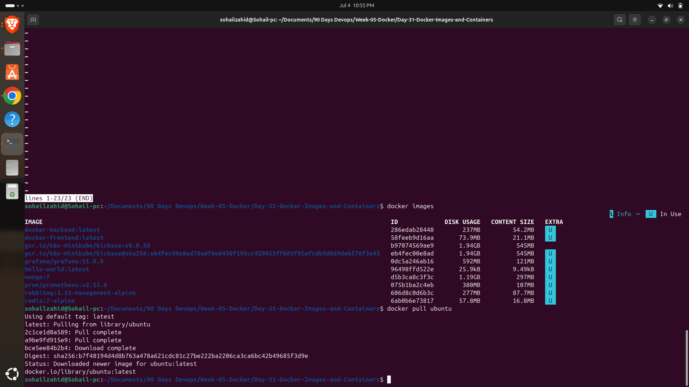
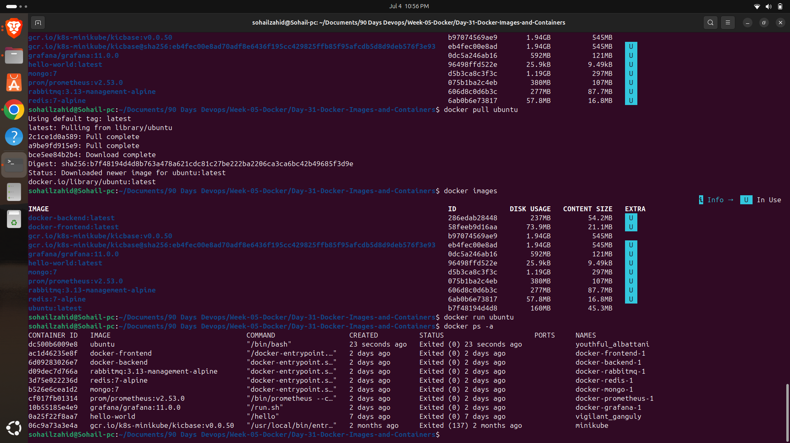
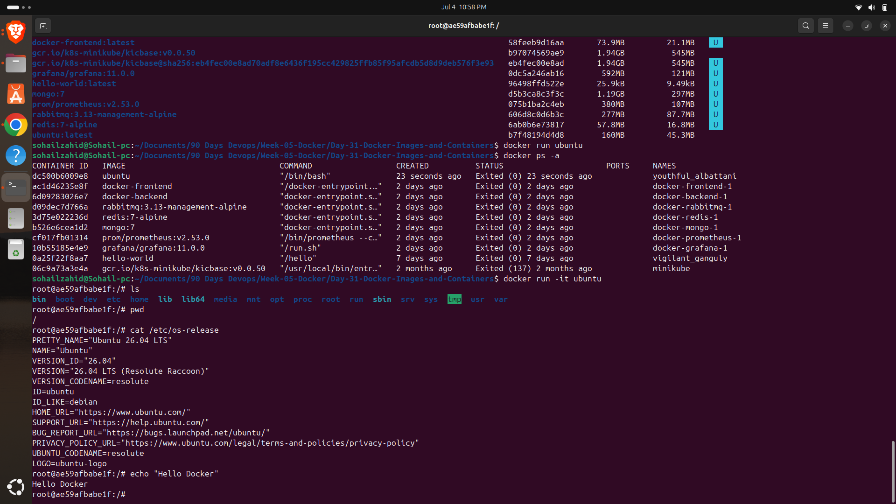
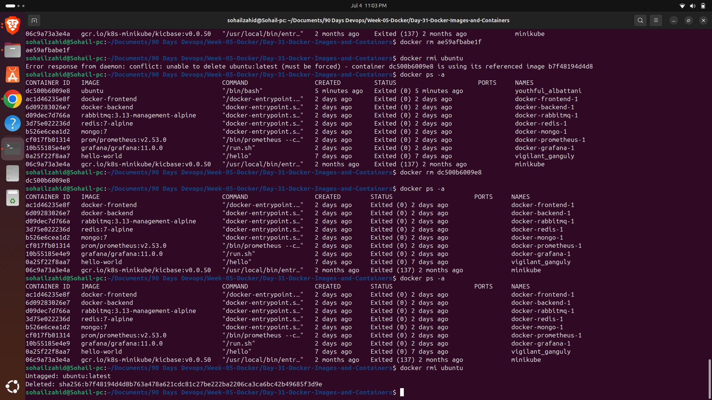

# Day 31 – Docker Images and Containers

## Objective

The objective of this lab was to understand the relationship between Docker Images and Containers by performing common Docker operations such as pulling images, creating containers, running interactive sessions, listing resources, and removing unused containers and images.

---

## Concepts Covered

- Docker Images
- Docker Containers
- Docker Registry (Docker Hub)
- Interactive Containers
- Image Lifecycle
- Container Lifecycle
- Docker CLI Commands

---

## Commands Practiced

```bash
docker --version
docker images
docker pull ubuntu
docker run ubuntu
docker run -it ubuntu
docker ps
docker ps -a
docker rm <container_id>
docker rmi ubuntu
docker info
```

---

## Practical Tasks Performed

- Verified Docker installation.
- Viewed Docker daemon information.
- Listed all available Docker images.
- Downloaded the latest Ubuntu image from Docker Hub.
- Created a container using the Ubuntu image.
- Started an interactive Ubuntu container.
- Explored the container filesystem.
- Verified the Ubuntu operating system version.
- Executed basic Linux commands inside the container.
- Listed running and stopped containers.
- Removed an unused container.
- Removed the Ubuntu image after deleting its dependent container.

---

## Key Learnings

- Docker Images are read-only templates used to create containers.
- Containers are lightweight, isolated runtime instances of images.
- Multiple containers can be created from a single image.
- Containers can be started, stopped, restarted, and removed independently.
- Images cannot be deleted while they are being used by existing containers.
- Interactive containers are useful for testing and learning Linux environments.

---

## Commands Inside the Container

```bash
pwd
ls
cat /etc/os-release
echo "Hello Docker"
```

---

## Outcome

Successfully understood the complete lifecycle of Docker Images and Containers by downloading images, creating containers, interacting with them, managing container resources, and cleaning up unused images.

---

---

# Screenshots

## 1. Docker Version



---

## 2. Docker Service Status



---

## 3. List Docker Images



---

## 4. Pull Ubuntu Image



---

## 5. Run Ubuntu Container



---

## 6. Working Inside Ubuntu Container



---

## 7. Remove Container and Docker Image


