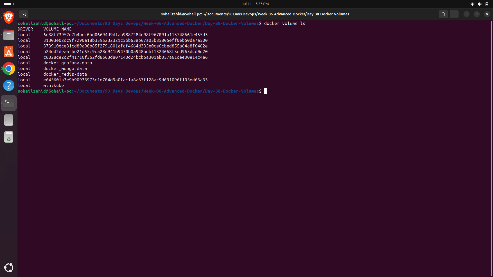
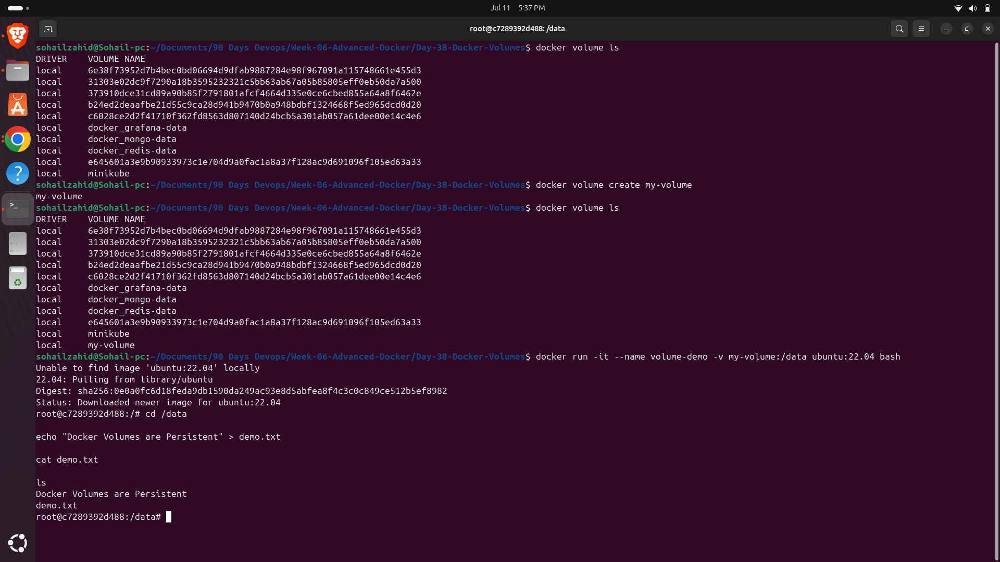
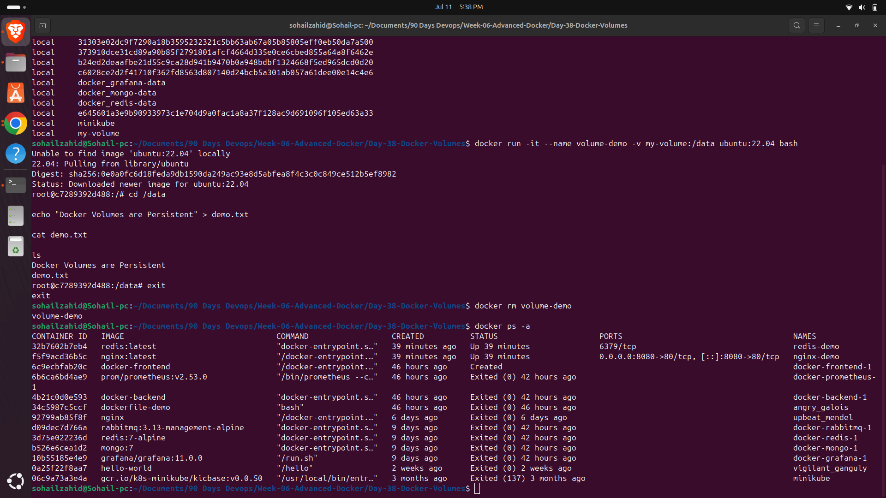
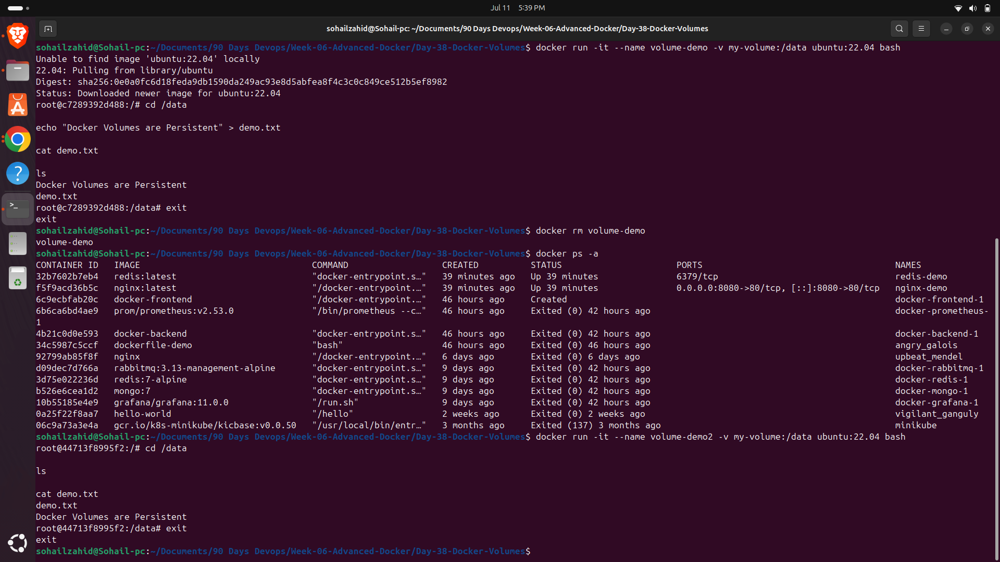

# Day 38 – Docker Volumes

## Objective

The goal of today's practice was to understand Docker Volumes and how they provide persistent storage for containers. Unlike container filesystems, Docker volumes retain data even after containers are removed.

---

## Environment

- Ubuntu 24.04
- Docker Engine
- Docker CLI
- Ubuntu 22.04 Container

---

# Step 1 – List Existing Docker Volumes

Command:

```bash
docker volume ls
```

This command displays every volume currently available on the Docker host.

## Screenshot



---

# Step 2 – Create a Docker Volume

Command:

```bash
docker volume create my-volume
```

Verify:

```bash
docker volume ls
```

Launch a container using the volume:

```bash
docker run -it --name volume-demo \
-v my-volume:/data \
ubuntu:22.04 bash
```

Inside the container:

```bash
cd /data

echo "Docker Volumes are Persistent" > demo.txt

cat demo.txt
```

## Screenshot



---

# Step 3 – Remove the Container

Exit:

```bash
exit
```

Remove it:

```bash
docker rm volume-demo
```

## Screenshot



---

# Step 4 – Verify Data Persistence

Launch another container using the same volume.

```bash
docker run -it --name volume-demo2 \
-v my-volume:/data \
ubuntu:22.04 bash
```

Inside:

```bash
cd /data

ls

cat demo.txt
```

The file created in the first container still exists.

This proves Docker Volumes preserve data independently of the container lifecycle.

## Screenshot



---

# What I Learned

- Docker volumes provide persistent storage.
- Containers can be removed without losing data.
- Multiple containers can share the same volume.
- Volumes are stored outside the container filesystem.
- Volumes are recommended for databases and application data.

---

# Commands Practiced

```bash
docker volume ls

docker volume create my-volume

docker run -it --name volume-demo \
-v my-volume:/data ubuntu:22.04 bash

echo "Docker Volumes are Persistent" > demo.txt

cat demo.txt

docker rm volume-demo

docker run -it --name volume-demo2 \
-v my-volume:/data ubuntu:22.04 bash

ls

cat demo.txt
```

---

## Conclusion

Docker Volumes solve one of the most important limitations of containers—data persistence. By storing application data outside the container lifecycle, volumes make Docker suitable for production workloads such as databases, web applications, and stateful services.
