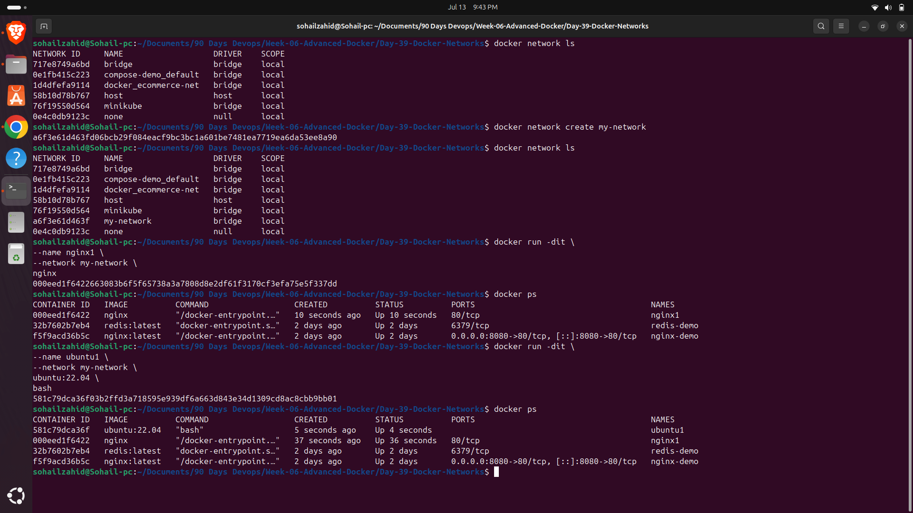

# Day 39 - Docker Networks

## Objective

Learn how Docker Networks allow containers to communicate securely using isolated virtual networks.

---

## What I Learned

Docker provides networking capabilities that enable multiple containers to communicate with each other without exposing every service directly to the host machine.

Today I practiced:

- Listing Docker networks
- Creating a custom bridge network
- Running containers inside the network
- Verifying communication using ping
- Inspecting Docker network configuration

---

## Commands Used

### List existing networks

```bash
docker network ls
```

### Create a custom network

```bash
docker network create my-network
```

### Verify network creation

```bash
docker network ls
```

### Start Nginx container

```bash
docker run -dit \
--name nginx1 \
--network my-network \
nginx
```

### Start Ubuntu container

```bash
docker run -dit \
--name ubuntu1 \
--network my-network \
ubuntu:22.04 \
bash
```

### Access Ubuntu container

```bash
docker exec -it ubuntu1 bash
```

### Install ping utility

```bash
apt update
apt install iputils-ping -y
```

### Test connectivity

```bash
ping nginx1
```

### Inspect network

```bash
docker network inspect my-network
```

---

# Screenshots

## Custom Docker Network Created



---

## Successful Container Communication


---

## Docker Network Inspection


---

## Key Takeaways

- Docker Bridge Networks isolate container communication.
- Containers can communicate using container names instead of IP addresses.
- Docker provides automatic DNS resolution inside custom networks.
- Custom networks improve security and simplify multi-container applications.
- Docker Networks are fundamental for microservices and container orchestration.

---

## Conclusion

Docker Networks simplify communication between containers by creating isolated virtual environments. Instead of relying on changing IP addresses, containers communicate using service names, making applications more scalable, secure, and easier to manage. This concept forms the networking foundation for Docker Compose, Kubernetes, and production-grade containerized applications.
