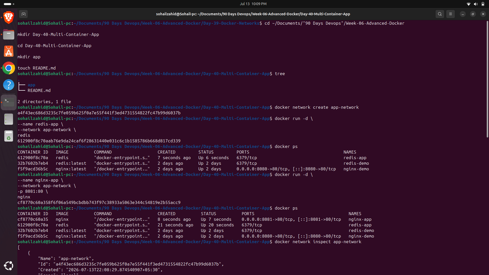
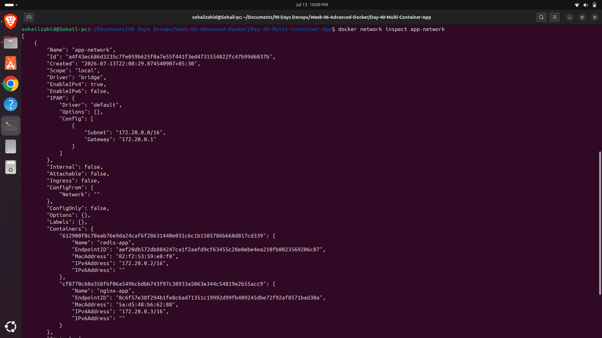
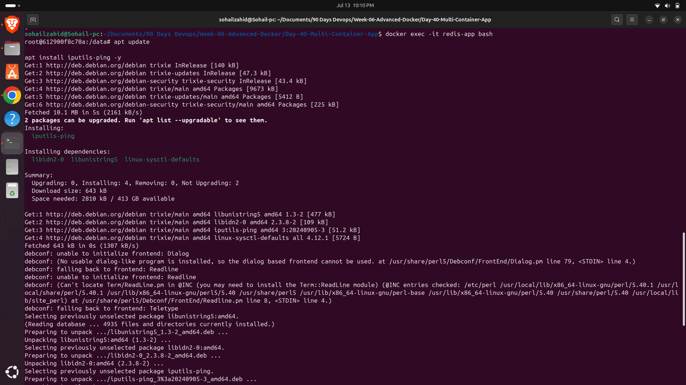
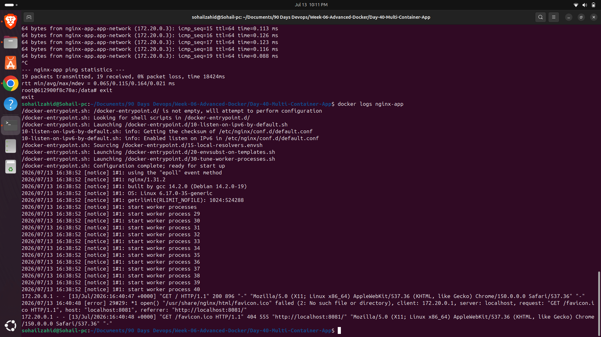
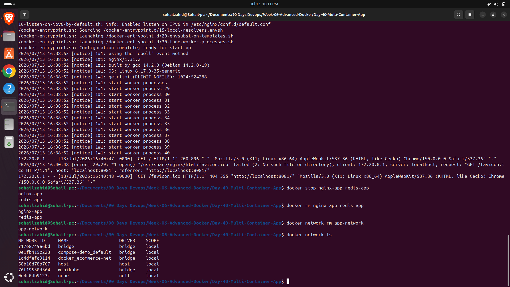

# Day 40 – Multi-Container Docker Application

## Objective

Learn how multiple Docker containers communicate using a custom Docker Bridge Network.

---

# Project Structure

```
Day-40-Multi-Container-App/
├── app/
└── README.md
```

---

# Step 1 – Create Docker Network

```bash
docker network create app-network
```

Verify:

```bash
docker network ls
```

---

# Step 2 – Launch Redis Container

```bash
docker run -d \
--name redis-app \
--network app-network \
redis
```

Verify:

```bash
docker ps
```

---

# Step 3 – Launch Nginx Container

```bash
docker run -d \
--name nginx-app \
--network app-network \
-p 8081:80 \
nginx
```

Verify:

```bash
docker ps
```

Open browser:

```
http://localhost:8081
```

---

# Step 4 – Inspect Docker Network

```bash
docker network inspect app-network
```

Output shows:

- Network Name
- Driver
- Gateway
- Subnet
- Connected Containers
- Assigned IP Addresses

Example:

```
redis-app

172.20.0.2

nginx-app

172.20.0.3
```

---

# Step 5 – Verify Container Communication

Enter Redis container

```bash
docker exec -it redis-app bash
```

Install ping

```bash
apt update

apt install iputils-ping -y
```

Test connectivity

```bash
ping nginx-app
```

Successful replies confirm Docker DNS resolution is working correctly.

---

# Step 6 – View Container Logs

```bash
docker logs nginx-app
```

Observe

- Startup logs
- Worker process initialization
- HTTP Requests
- Browser access logs

---

# Cleanup

Stop containers

```bash
docker stop nginx-app redis-app
```

Remove containers

```bash
docker rm nginx-app redis-app
```

Delete network

```bash
docker network rm app-network
```

---
## Screenshots










---

# Concepts Learned

- Multi-container architecture
- Docker Bridge Network
- Docker DNS
- Container-to-container communication
- Network Inspection
- Viewing container logs
- Cleaning up Docker resources

---

# Commands Practiced

```bash
docker network create

docker network inspect

docker run

docker ps

docker exec

apt install iputils-ping

ping

docker logs

docker stop

docker rm

docker network rm
```

---

# Key Takeaways

- Containers communicate through Docker Bridge Networks.
- Docker automatically provides DNS-based service discovery.
- Containers can reach each other using container names.
- Docker logs help monitor running applications.
- Proper cleanup prevents unused Docker resources from accumulating.

