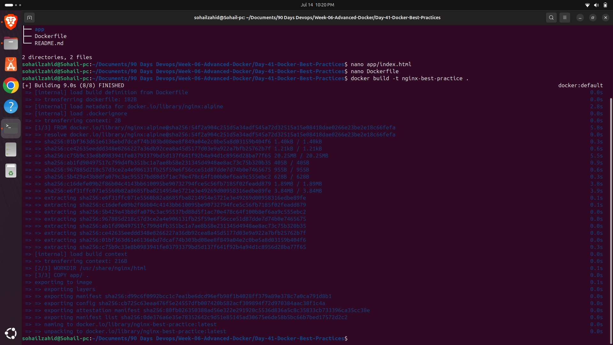
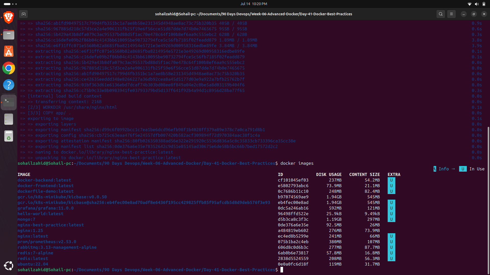
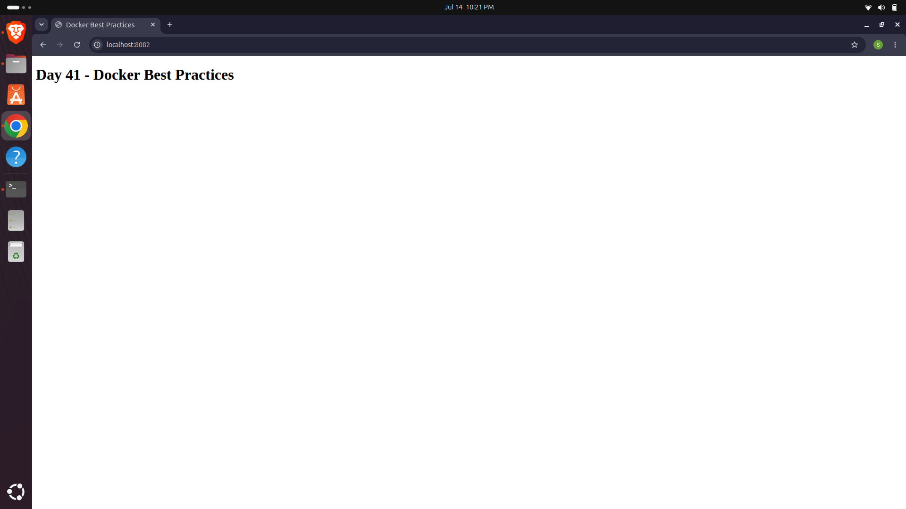
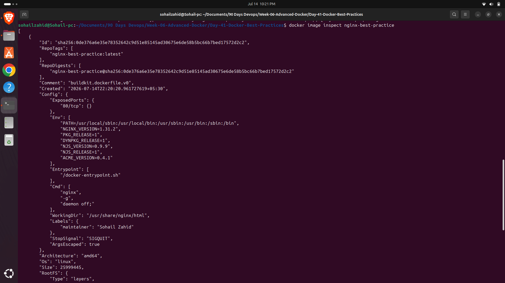

# Day 41 - Docker Best Practices

## Objective

Learn Docker image optimization techniques and implement Dockerfile best practices for creating smaller, secure, and production-ready container images.

---

## Project Structure

```
Day-41-Docker-Best-Practices/
│
├── app/
│   └── index.html
│
├── Dockerfile
├── README.md
│
├── 01-project-structure.png
├── 02-build-custom-image.png
├── 03-run-custom-image.png
└── 04-image-inspect.png
```

---

## What I Learned

- Writing clean and maintainable Dockerfiles
- Using lightweight base images (Alpine Linux)
- Reducing Docker image size
- Organizing Dockerfile instructions
- Adding metadata using LABEL
- Setting WORKDIR
- Copying application files efficiently
- Exposing container ports
- Building optimized Docker images
- Running custom Docker images
- Inspecting Docker image metadata

---

## Dockerfile

```dockerfile
FROM nginx:alpine

LABEL maintainer="Sohail Zahid"

WORKDIR /usr/share/nginx/html

COPY app/ .

EXPOSE 80

CMD ["nginx", "-g", "daemon off;"]
```

---

## Commands Used

### Build Image

```bash
docker build -t nginx-best-practice .
```

### List Images

```bash
docker images
```

### Run Container

```bash
docker run -d \
--name nginx-best-practice-container \
-p 8082:80 \
nginx-best-practice
```

### Inspect Image

```bash
docker image inspect nginx-best-practice
```

### Stop Container

```bash
docker stop nginx-best-practice-container
```

### Remove Container

```bash
docker rm nginx-best-practice-container
```

---

# Screenshots

## 1. Project Structure



---

## 2. Building the Docker Image



---

## 3. Running the Custom Docker Image



---

## 4. Inspecting Docker Image Metadata



---

## Key Takeaways

- Smaller Docker images improve deployment speed.
- Alpine Linux significantly reduces image size.
- Docker LABEL provides useful metadata.
- WORKDIR keeps Dockerfiles organized.
- Docker image inspection helps verify image configuration.
- Following Docker best practices leads to secure, efficient, and production-ready containers.

---

## Skills Practiced

- Docker
- Dockerfile
- Docker Images
- Image Optimization
- Docker Best Practices
- Containerization
- Nginx
- Alpine Linux

---

